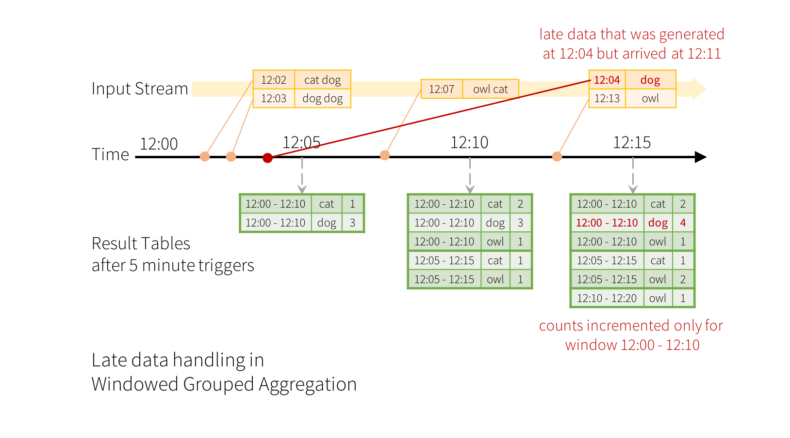

# 1.X 데이터 파이프라인

이번 챕터에서는 데이터 파이프라인의 구성요소에 대해 이야기 합니다. 가상의 작은 회사 우동마켓을 가정하고, 우동마켓이 성장하면서 마주치는 문제들을 데이터 인프라 컴포넌트와 함께 하나씩 알아봅니다.


우동마켓은 장류진 작가님의 소설 [일의 기쁨과 슬픔](http://www.yes24.com/Product/Goods/80742923) 속에 나온 가상의 스타트업입니다. 현실 세계에 존재하는 회사와는 관련이 없습니다.&#x20;



가상의 스타트업 우동마켓은 글로벌한 우동 서비스를 제공하려는 야욕을 가지고 있습니다. 면과 토핑, 국물 및 송송썰린 파와 같은 재료의 직판매 부터 시작해서 수 많은 우동 매니아를 위한 우동 추천 서비스, 비행기 입국장에서 사용자를 노려 국내 유수의 우동집을 홍보하는 타게팅까지를 목표로 하고 있습니다.&#x20;

이른바 "우동 커머스" 를 제공하려는, AWS 를 사용하는 초기 단계의 우동 스타트업의 데이터 파이프라인이 어떨지 논의해 봅시다.


### 초기 단계&#x20;

초기 단계의 스타트업에는 데이터 엔지니어가 필요 없을지 모릅니다.

* AWS 내에 [RDS](https://aws.amazon.com/rds/?p=pm\&c=db\&z=3), Redis (세션 등 용도) 와 같은 필수 저장소만 사용하고 있고&#x20;
* 아직은 기능을 만드는데 바빠 상품 검색은 MySQL 에서 LIKE 검색을
* 추천 상품은 단순히 판매건 기준으로 정렬해 Top 10 만 내보내고 있습니다

\[그림] 우동마켓 초기 인프라 (AWS VPC 내 RDS, EC, EC2 정도)


이때 기획자로부터 첫 번째 데이터 요건이 들어옵니다.

* 데이터를 보고 싶다
* 실시간이면 좋겠다
* 개발자들은 기능 만드는데 바쁘니 쿼리보다는 UI 를 통해 이런저런 데이터를 보거나 가공할 수 있어야 한다


가장 쉬운 방법은 실제 서비스 DB 에 붙어 데이터를 보는것입니다. 물론 당연히 (...) 그러면 안됩니다. 따라서 AWS RDS 에 [Read Replica](https://aws.amazon.com/ko/rds/features/read-replicas/) 를 이용하면 (데이터가 적은 우동마켓의 경우에는) 아주 약간의 지연이 있을뿐, 실제 서비스 DB 를 실시간 / 비동기로 복제해 데이터를 확인할 수 있습니다.&#x20;

 (1) (1).png>)

[AWS Aurora](https://aws.amazon.com/ko/rds/aurora/?aurora-whats-new.sort-by=item.additionalFields.postDateTime\&aurora-whats-new.sort-order=desc) 를 RDB 로 사용한다면 내부적으로는 조금 다르게 동작할 수 있으나 마찬가지로 [Aurora Read Replica](https://docs.aws.amazon.com/ko\_kr/AmazonRDS/latest/AuroraUserGuide/Aurora.Replication.html) 를 추가할 수 있습니다.&#x20;

* AWS Aurora 는 최대 15개의 Read Replica 를 지원합니다.
* AWS RDS 는 최대 5개의 Read Replica 를 지원합니다.

Aurora 와 RDS 는 내부적인 구조가 다릅니다. 다음 그림을 통해 동작 방식이 어떻게 다를지 추론해볼 수 있습니다.

 (1) (1) (1).png>)


이렇게 추가된 읽기 전용 DB 에 우동마켓 내부 직원들이 사용하기 편리한 데이터 탐색 도구를 선정해 붙일 수 있습니다.&#x20;

* [AWS Quicksight](https://docs.aws.amazon.com/ko\_kr/quicksight/latest/user/how-quicksight-works.html) 와 같은 클라우드 관리형 도구를 사용하거나
* [Metabase](https://www.metabase.com) 처럼 쉽게 드래그 & 드랍을 통해 누적 차트와 대시보드를 쉽게 만들 수 있는 오픈소스 도구를 활용하거나
* [Retool](https://retool.com) 과 같이 내부 사용자 Admin 을 개발 없이 빠르게 보는 도구를 사용할 수도 있습니다.
* [Redash](https://redash.io) 를 사용한다면 DB 뿐만 아니라 구글스프레드시트 등 다양한 도구와 연동되며, 내부 사용자들이 쿼리를 작성하고, 쉽게 공유하고 그것으로 대시보드를 만들 수 있습니다.
* 이외에도 [Superset](https://superset.apache.org) 이나 [Tableau](https://www.tableau.com/ko-kr) 와 같은 도구들은 데이터를 '한번 더' 가공해 깔끔하게 만든 뒤 대시보드에 다양한 기능을 넣고 꾸미는 기능에 강점이 있기도 합니다.

도구는 회사 내부 사용자들의 생산성을 결정하므로, 적절한 도구를 선택해 제공할 수 있습니다.&#x20;

일반적으로는 여러 종류의 DB (RDB, NoSQL) 는 물론 구글 시트 등 다양한 시스템과 연동되고 다른 사람이 작성한 쿼리 / 대시보드 등을 쉽게 검색하고 재활용할 수 있으며 운영성으로 대용량 CSV 다운로드가 가능한 Redash 가 많이 쓰이는 편입니다.&#x20;

필요하다면 여러 도구를 제공하는 것도 물론 가능합니다. 다만 늘 그렇듯이, 해당 시스템을 운영하는 엔지니어의 노동 비용 그리고 머신 값으로 지불해야 할 물리 비용, 사내 사용자들의 학습 부하 및 데이터 활용의 집중이 아니라 분산 (다양한 도구 사용시) 이 발생할 수 있으므로 적절한 한도 내에서 몇몇 도구를 사용할지 결정하면 됩니다.


여러분이 도입하는 모든 데이터 도구는, 데이터로 일하는 회사 구성원 전부의 생산성에 영향을 미칩니다. 따라서 단순히 '이 기능이 좋아' 보다는 다음 내용들을 고려하여 제공해야 합니다.

* 여러 시스템과의 연동
* 코드 수정 및 확장 가능성
* 다양한 활용처: 대용량 CSV 데이터 다운로드 / 데이터 탐색 / 대시보드 등



\[그림] Read Replica 에 다양한 도구를 붙이는 경우


데이터 탐색 도구를 DB 에 붙이면 이제 준 실시간으로 (Read Replica 의 지연을 제외하면) 서비스의 데이터를 볼 수 있습니다. 그러나 몇 가지 제한점이 존재합니다.&#x20;

* 우동마켓은 그 자그마한 서비스 규모에 걸맞지 않게, MSA 를 하느라 DB 를 여러개 사용합니다. DB 가 여러개이므로 DB 내에서 Join 이 불가능합니다.
* 우동마켓은 RDB 이외에도 [Elasticache](https://aws.amazon.com/ko/elasticache/) (AWS managed ElasticSearch) 와 AWS OpenSearch (AWS 관리형 ElasticSearch) 를 사용합니다.&#x20;
* 우동마켓의 서비스 DB 인 RDB 는 사용할 수 있는 Query 문법이 별로 신통치 않습니다. MySQL 특정 버전 이후부터 With Clause Window Function, JSON Function, Spatial Function 이 지원됩니다. 다만 그정도이지, Unnest 등 다양한 패턴을 일관되고 사용성 높은 함수로 지원하지 못합니다. 게다가 문법이 다른 MySQL 이외의 DB 를 인수합병, 너와 내가 사이가 나빠 시작하는 MSA 등으로 도입하는 순간 쿼리 사용자는 지옥으로 가게됩니다.


따라서 다음의 요구사항을 충족하는 범용, 대규모 처리 쿼리 엔진이 필요합니다.

* 다양한 스토리지 (RDB, NoSQL) 를 지원하고 서로 다른 스토리지의 데이터를 Join 할 수 있습니다.
* 스토리지에 상관 없이 일관되고 사용성이 편리한 SQL 문법을 제공합니다.
* 대규모 데이터를 메모리에서 빠르게 처리할 수 있습니다.

[Apache Presto](1.1.md#undefined) 는 이런 용도를 위해 설계된 범용, 대규모 쿼리 엔진입니다. AWS 에서는 [EMR](https://docs.aws.amazon.com/emr/latest/ReleaseGuide/emr-presto.html) 위에서 편리하게 사용할수 있습니다. 만약 직접 운영하지 않는다면 [AWS Athena](https://docs.aws.amazon.com/athena/latest/ug/what-is.html) 와 같은 관리형 서비스를 사용할 수 있습니다. ([Athena 는 Presto 를 기반으로 만들어졌습니다.](https://aws.amazon.com/ko/athena/faqs/))

 (1).png>)


Presto 를 이용하면 다양한 커넥터를 붙여 SQL 을 이용해 Join 하고 가공할 수 있습니다. 예를 들어, 아래의 Presto 쿼리는 RDB 로는 처리하기 힘든 대량의 데이터를 보관하는 Hive (엄밀히는 S3 또는 HDFS) 와 실제 서비스에 내보내는 RDB Replica 내의 메타값을 Join 해 집계하는, 서로 다른 두 저장소를 Presto 내에서 묶어 컴퓨팅하는 예제입니다.

```sql
SELECT AIRPORT.name as airport_name, count(*) as flight_count
FROM hive.flight_history.flights FLIGHT
JOIN mysql.flight_meta.airport AIRPORT 
  ON FLIGHT.code = AIRPORT.airport_code
GROUP BY AIRPORT.name
ORDER BY flight_count
LIMIT 100
```

Presto 는 JDBC / ODBC 를 통해 사용이 가능하며, HTTP API 로도 쿼리를 실행할 수 있습니다. 위 Presto 설명에 나온 사진과 같이 대부분의 오픈소스 / 상용 데이터 분석 도구는 전부 사용이 가능하며, 필요시 내부에서 JDBC / HTTP 등의 프로토콜을 이용해 직접 인하우스 분석 도구를 개발하는 것도 가능합니다.


\[그림] Presto 또는 Athena 를 통한 우동마켓 서비스 분석도


### 중반부: 저장소 데이터 입수


이제 데이터를 '보는 것' 은 가능해 졌습니다. 원하는 스토리지에서 쿼리해 대시보드를 만들수도 있고, 마케팅이나 CS 대응과 같은 필요한 데이터도 CSV 로 추출하는것이 가능합니다.

쿼리를 모르는 사용자도, 자신이 사용하는 Google Sheet 를 분석 도구에 연동하고 [Widget](https://redash.io/help/user-guide/querying/query-parameters) 을 활용해 데이터 분석 마우스만으로도 운영성 데이터를 뽑아낼 수 있습니다.

 (1) (1) (1).png>)


그러나 여전히 몇 가지 문제가 있습니다.

* Read Replica 를 통해 (준) 실시간으로 데이터를 확인하는건 좋은 일이지만, 컴퓨팅이 스토리지에 의존합니다. 다시 말해, Read Replica 사이즈에 따라 스캔 속도가 좌우됩니다.&#x20;
* Presto 가 [Predicate Push Down](https://trino.io/docs/current/optimizer/pushdown.html) 지원하지 않는 스토리지거나, 특정 Presto SQL 구문의 경우에만 Push Down 이 동작하지 않을수도 있습니다. Push Down 을 이용하면, 필터링을 데이터를 가져온 이후에 메모리에서 수행하는 것이 아니라 데이터를 가져오는 시점부터 저장소가 제공하는 필터링을 사용할 수 있기 때문에 훨씬 효율적입니다.
* 스토리지 종류에 따라 당장 Read Replica 를 추가하기 어려운 경우도 있습니다. 관리형 서비스인 AWS RDS, Aurora, Elasticache (Redis, 모드에 따라) 는 읽기 전용 Endpoint 를 지원하지만 다른 저장소는 그렇지 않을수도 있습니다.

또한 RDB 의 데이터는 무한히 적재할 수 없습니다. 주문, 예약 등 비즈니스 크리티컬한 데이터가 아니라 단순 History 성 테이블의 경우에는 어느 순간에는 특정 시점을 기준으로 과거 데이터는 서비스 테이블에서 분리해 보존처리 해야할 수 있습니다.

이런 이유로 인해 '주기적으로' 데이터를 대량의 컴퓨팅을 수행할 수 있는 저장소로 옮겨오는 작업이 필요하게 됩니다.&#x20;

* RDB, NoSQL (Redis, ElasticSearch 등) 에서 데이터를 읽어 AWS S3 / HDFS 등에 저장합니다.&#x20;
* HDFS 는 별도로 Hadoop 을 운영해야 하므로 특정 상황이 아니라면 적은 규모에서는 S3 에 데이터를 적재합니다.&#x20;
* AWS LB Acess Log / RDS Export 등 AWS 서비스는 S3 에 데이터를 저장하는 것을 지원합니다.&#x20;
* AWS S3 내 JSON, [Parquet](1.1.md#undefined) 등의 형식으로 적재시에 Athena 등 다양한 서비스에서 읽어 사용할 수 있습니다.&#x20;
* AWS S3 는 데이터를 저장하고 데이터를 읽는 용도 이외에도 [Storage Class](1.1.md#undefined) 를 통해 사용이 덜 되는 데이터는 Tier 를 낮추어 비용을 절감하는 등의 다양한 기능을 제공합니다.

[Apache Parquet](https://parquet.apache.org/documentation/latest/) 는 추후 File Format 챕터에서 다루기에 간단히만 설명하자면 다음과 같습니다.

* 컬럼을 중심으로 데이터를 저장하는 Columnar Format 입니다. 대부분의 데이터 조회 및 가공시에는 전체 컬럼을 접근하지 않고 (`SELECT *`), 일부 컬럼만을 사용하므로 (`SELECT airport_name, airport_code`) 데이터를 읽어오는 시점부터 필요한 컬럼만 읽어올 수 있습니다.
* 컬럼 중심으로 데이터를 저장하므로 성별이나 도시 등의 ENUM 값처럼 Cardinality 가 비교적 낮은 값들의 데이터 사이즈를 많이 줄일 수 있습니다. (e.g, MALE = 1, FEMALE = 2 로 저장) 또한 File 자체에서 타입과 스키마를 지원하므로 파일을 읽는 시점부터 마치 RDB 와 같은 저장소처럼 데이터를 필터링해 가져올 수 있습니다.&#x20;
* Snappy 등과 같은 압축 알고리즘과 같이 사용하면, 파일 사이즈를 굉장히 많이 줄일 수 있습니다.&#x20;


다음 사진은 AWS RDS 또는 AWS Aurora 에서 S3 로 DB 스냅샷을 내보내는 걸 도식화 한 그림입니다.

\[그림] RDS 데이터를 주기적으로 퍼오는 그림 S3

 (1) (1).png>)




한 가지 고민해보아야 할 점이 있습니다. AWS RDS / Aurora 를 S3 로 Snapshot 내보내는 AWS CLI API 를 살펴보면 어떤 인스턴스 내 DB / Table 를 뽑아낼지를 결정할 수 있습니다.

* [AWS RDS (Aurora) CLI start-export-task](https://docs.aws.amazon.com/cli/latest/reference/rds/start-export-task.html)
* [AWS RDS Export Snapshot Limitation](https://docs.aws.amazon.com/ko\_kr/AmazonRDS/latest/UserGuide/USER\_ExportSnapshot.html)

```
  start-export-task
--export-task-identifier <value>
--source-arn <value>
--s3-bucket-name <value>
--iam-role-arn <value>
--kms-key-id <value>
[--s3-prefix <value>]
[--export-only <value>]
[--cli-input-json <value>]
[--generate-cli-skeleton <value>]

```


CLI 옵션을 살펴보면

1. 어떤 Column 만 추출할지 결정할 수 없습니다. 개인정보나 민감한 정보가 들어있는 컬럼이 S3 로 Export 된다면, Network 기반이 아니라 IAM 단위로 관리되는 S3 에서는 접근 통제가 충분히 되지 않을 경우 문제가 될 수 있습니다.
2. Column 이름 변경이나 값을 변경할 수 없습니다. 일부 정보는 마스킹 하거나, 필요에 따라 타입과 값을 변경할 필요가 있는데, Snapshot S3 Export 기능으로는 불가능합니다.&#x20;
3. 타입은 특히나 중요한데, 저장된 데이터는 MySQL 등 RDB 타입에서 Parquet 타입으로 변경되고, 이렇게 만들어진 Parquet 파일은 Presto, Hive, Spark 등 다양한 시스템에서 호환되는 타입이어야만 합니다.&#x20;
4. 가장 중요한, 실행되는 컴퓨팅 리소스를 조절할 수 없습니다. 필요에 따라 크기가 큰 테이블은 컴퓨팅 리소스를 더 부어 넣어  원하는 시점에 빠르게 끝낼 수 있어야 하는데, Snapshot S3 Export 는 불가능합니다.

따라서 RDS Snapshot S3 Export 기능은 민감정보가 없는 DB 와 Table 의 백업을 단순히 보관하는 용도에 가깝다는것을 알 수 있습니다.


이보다 더 많은 수준의 제어를 제공하는 AWS DMS (Database Migration Service) 를 사용할 수도 있습니다.

 (1) (1).png>)

* DMS 는 복제 컴퓨팅을 수행할 리소스를 사용자가 지정할 수 있습니다 (dms.r5.xlarge 등)
  * [AWS DMS Instance Type](https://docs.aws.amazon.com/ko\_kr/dms/latest/userguide/CHAP\_ReplicationInstance.Types.html)
* 컬럼 및 컬럼 값에 대해 필터링 기능과 변경 기능을 (일부) 제공합니다.
  * [AWS DMS Transformation](https://docs.aws.amazon.com/ko\_kr/dms/latest/userguide/CHAP\_Tasks.CustomizingTasks.TableMapping.SelectionTransformation.Transformations.html)
  * [AWS DMS Source Filters](https://docs.aws.amazon.com/ko\_kr/dms/latest/userguide/CHAP\_Tasks.CustomizingTasks.Filters.html)
* CDC (Change Data Capture) 등 RDB 입수 관련된 다양한 기능을 제공합니다.
* 그러나 지정된 데이터 소스 및 타겟만 입수가 가능합니다.
  * [AWS DMS Available Source](https://docs.aws.amazon.com/dms/latest/userguide/CHAP\_Source.html)
  * [AWS DMA Available Target](https://docs.aws.amazon.com/dms/latest/userguide/CHAP\_Target.html)

CDC 는 Delta (변경분, 증감) 에 대해서만 실시간으로 가져올 수 있다는 장점이 있습니다. 다만 초기 스타트업에서는 다음과 같은 이유로 당장 필요하지 않을 수 있습니다.

* 인스턴스를 띄워놓아야 하므로 비용이 듭니다, 이러한 이유로 실시간 / 스트림 처리는 일반적으로 비용이 많이 듭니다.
* S3 등에 델타, 즉 변경분에 대한 데이터만 적재할 경우, 사용하는 측에서 특정 시점에 대한 '상태' 를 만들어야 합니다. 그렇지 않을 경우, '우리 회사의 전체 우동 판매 이력' 를 얻기 위해서는, 전체 데이터, 즉 델타 전체를 조회해야 합니다. (일반적으로 CDC 를 사용할 경우 사용측의 편리함을 위해 일별 등 특정 시점을 기준으로 데이터를 누적해 State 를 만들어 놓습니다.)


CDC (Change Data Capture) 는 위에서 논의한 것과 같이 다양한 장점 및 단점이 존재합니다. 그렇다면 언제 CDC 를 사용하면 유용할까요?&#x20;



DMS 는 RDB 를 다른 곳으로 (RDB 나 일부 관리형 AWS 스토리지: S3, Dynamo) 내보내기 위한 도구로는 더 할 나위 없이 좋습니다. 그러나 우동마켓에서 DMS 가 지원하지 않는 스토리지를 사용한다거나, 더 높은 수준의 컨트롤 및 컴퓨팅 리소스 제어가 필요하다면 다음의 도구들을 이용할 수 있습니다.

* AWS Glue: 커스텀 코드를 작성할 수 있는 관리형 ETL 도구를 제공합니다. 사용자는 Spark 등 컴퓨팅 프레임워크를 작성해 AWS Lambda 와 비슷하게 배포하고, 원하는 컴퓨팅 사이즈를 선택하면 AWS 가 사용자가 요청한 스케쥴에 맞추어 실행해 줍니다.
  * AWS Glue 에는 다양한 부가 서비스가 존재합니다.
    * [AWS Glue Catalog](https://docs.aws.amazon.com/ko\_kr/glue/latest/dg/what-is-glue.html)
    * [AWS Glue DataBrew](https://aws.amazon.com/ko/glue/features/databrew/)
    * [AWS Glue Elastic View](https://aws.amazon.com/ko/glue/features/elastic-views/)
* [AWS EMR](https://aws.amazon.com/ko/emr/): Spark 등 빅데이터 프레임워크의 컴퓨팅 리소스 환경을 제공해줍니다. 사용자는 Spark 코드를 작성하고 EMR Cluster 에 Submit 할 수 있습니다. &#x20;
  * AWS EMR 의 컴퓨팅 리소스는 배치가 많은 시간에 수동으로 늘리고 줄이거나, Spot 인스턴스 사용등을 통해 비용 절감이 가능합니다.&#x20;
  * [AWS EMR 관리형 Auto Scaling](https://docs.aws.amazon.com/emr/latest/ManagementGuide/emr-managed-scaling.html) 기능을 제공해 작업이 많은 시점에 자동으로 리소스를 조절할 수 있습니다.

위에 나열한 데이터 수집 방법 이외에도 다양한 방법을 사용할 수 있습니다.&#x20;

* 시간별 DB 입수를 위해 EC2 인스턴스를 Spot 주기적으로 띄워 원하는 코드를 AMI 에 넣거나, Ansible 등을 통해 리모트에서 실행할 수 있습니다.&#x20;
* Airflow 을 별도로 운영하거나 AWS Managed Airflow 를 비용을 내고 사용할 수 있습니다. Airflow 의 다양한 플러그인을 이용해 Airflow Worker 에서 빠르고 쉽게 데이터를 읽어 저장소에 내보내는것도 가능합니다.&#x20;


AWS RDS Snapshot Export, AWS DMS, AWS EMR 모두 각기 장단점이 있습니다.&#x20;

* 더 많은 제어를 사용자가 획득할수록, 더 많은 옵션으로 인해 운영 비용이 높습니다.
* 반면 사용하기 쉬울수록, 즉 옵션이 적을수록 운영 비용은 적은 반면 사용자가 원하는 기능이 없을 경우 대안이 없거나, 확장이 불가능하는 등의 문제가 발생할 수 있습니다.


우동마켓의 규모가 작을때 / 중간 사이즈일때를 나누어 어떤 데이터 파이프라인을 가지면 좋을지 생각해 봅시다.



데이터 수집 과정에서 기술을 선정할 때 고려해야 할 것은 크게 3가지입니다.

* 다양한 데이터 저장소와 포맷을 입수할 수 있는가?&#x20;
  * RDB, NoSQL 부터 시작해 사내 사용자가 사용하는 Google Sheet, CSV, JSON 등 단순 파일 포맷은 물론 Client / Server 가 보내는 Event 등 다양한 데이터를 **어떤 저장소에서 / 어떤 프레임워크가 읽어 / 어느곳에 저장할지**
* 데이터 사이즈가 커짐에 따라 수집 인프라를 확장할 수 있는가?&#x20;
  * 데이터를 읽거나, 내보내는 저장소는 'Storage' 라는 이름에서 볼 수 있듯이 일반적으로 확장이 가능합니다.&#x20;
  * 데이터를 수집하기 위해 컴퓨팅을 수행하는 중간 프로세싱 단계의 인프라가 확장이 되지 않는 경우가 있습니다. 예를 들어 Airflow 에서 단일 Worker 를 사용해 데이터를 처리한다던지 등
  * 따라서 Spark 등의 분산처리 / 메모리 + Disk 를 지원하는 데이터 처리 프레임워크를 선택해 추후 데이터 사이즈가 커질 때 컴퓨팅 리소스를 늘려, "원하는 시점에, 원하는 속도로" 결과물을 낼 수 있어야 합니다.
*   인프라를 운영하는 엔지니어의 운영 부담

    * 다양한 도구를 활용하는 건 엔지니어 개인으로서는 재밌는 도전일 수 있겠습니다. 그러나 동일한 종류의 데이터 입수에 Airflow, Spark, Nifi 등 다양한 프레임워크를 활용하면, 이것을 운영해야 하는 엔지니어 입장에서는 규모가 커졌을때 문제가 됩니다.&#x20;
    * 예를 들어, 입수해야 할 테이블이 수십개라면 원하는 다양한 도구를 사용해도 문제가 없지만 개별 엔지니어가 관리하는 테이블이 수백개, 수천개에 이른다면 개인의 컨텍스트 스위칭으로 인한 인지적 부하는 물론 휴가 / 백업  / 채용등 조직 관리적인 이슈까지 포함하면 사용하ㄴ 도구, 즉 프레임워크를 단일화 하는 편이 낫습니다.



왜 데이터 인프라 / 파이프라인을 운영하는데, 엔지니어의 운영 부담을 고민해야 하는 걸까요? 다음 두 가지 관점에서 고민해 봅시다

* 개인마다 다른 도구를 사용할때 '팀' 으로서의 시너지
* EC2 머신은 늘리면 늘어나지만, '사람' 은 버튼 누른다고 늘릴 수 없는 것



### 중반부: 로그 (Client / Server) 데이터 입수

기획자로부터 추가적인 요건이 들어옵니다.\
서비스 개발팀이 DB 에 쌓아준 우동 주문건과 회원가입 등 데이터는 잘 보고 있지만, 이것 외 사용자의 앱 내에서 활동 이력을 분석해 보고 싶다고 합니다.

* 현재 슈퍼앱을 지향하는 우동마켓 앱 내 메인 홈에서 '수타 면발 전시회' 메뉴의 위치를 더 올려야 할지
* 어제 만든 '차슈에 진심인 집들' 기획전 페이지의 사용자가 차슈 구매까지 얼마나 이어지는지

\
일반적으로 DB 등 스토리지에서 입수하는 데이터가 아니라 사용자의 Client (App / Web) 등에서 발생하는 데이터를 '이벤트' 또는 '로그 ' 라고 부릅니다.서버에서도 로그, 또는 조금 더 격식을 갖춘 '이벤트' 를 만들어낼 수 있습니다.

* API 등에서 Logging Framework 를 통해 만드는 일반 Application '로그' 일수도 있고 (INFO, ERROR 등)
* 비즈니스 용도로 [Protobuf](https://developers.google.com/protocol-buffers), [Avro](https://avro.apache.org/docs/current/) 등 포맷을 갖추어 전송하는 '이벤트' 일 수도 있습니다.

\
다만 이 챕터에서는 편의상 둘을 구분하지 않고 '이벤트' 라고 부르겠습니다. Client / Server 의 데이터 전송방식과 데이터 형식에 대해서는 추후 다른 챕터에서 논의해보겠습니다.\
다시 우동마켓 기획자가 요구했던 내용으로 돌아와서, 당연히 사용자 Client (웹 / 앱) 내 활동 이력 (특정 페이지 View, 광고 상품 Impression 등) 또한 DB 내에 당연히 쌓을 수 있습니다.\
그러나 다음 내용을 고려하면, DB 보다는 다른 곳에 쌓는 편이 더 나을 수 있습니다.

* 사용자의 특정 페이지 방문 등 '이벤트' 데이터는 '변경' 되지 않습니다.
* 분석 용도가 아니라면 당장은 서비스에 쓸, 다시 말해 API 에서 DB 접근해서 다시 내보내야 할 경우가 거의 없습니다.
* 그리고 RDB 에 쌓는 일반적인 트랜잭션 데이터에 비해, 사용자 활동 이력은 '매우' 많습니다. 주문 1건이 발생하기 위해 사용자가 앱 내에서 어떤 활동을 하는지를 생각해봅시다.
* 따라서 RDB 는 API 에서 '접근하기 쉬운' 저장소이지, 비용 효율적인 저장소는 아닙니다.

\
일반적으로 대량의, 비정형 데이터를 받는 용도로 Kafka 와 같은 Queue 를 많이 사용합니다.

* 그러나 최소 비용이 많이 필요할 수 있습니다. Kafka 는 3대 이상의 클러스터로 운영해야 하고 Zookeeper 클러스터도 필요하기 때문입니다. (Kafka 2.X 기준)
* 또한 Kafka 운영 및 모니터링에 노동비용이 많이 필요할 수 있습니다.
* AWS 에서는 관리형 Kafka 로 [AWS MSK](https://aws.amazon.com/ko/msk/) 를 제공해 수 있어, 업그레이드 및 스케일링으로 인한 노동 비용을 줄이고 모니터링을 편리하게 할 수 있습니다.

\
당장은 Client (App / Web) 이벤트만 전송하고, 비용 문제로 인해 Kafka 사용이 어렵다면 AWS Kinesis 도 좋은 대안이 될 수 있습니다.

 (1).png>)


AWS Kinesis 는 비용도 매우 저렴하고, Client 에서 Kinesis 로 바로 전송할 수 있고 SDK 도 Android / iOS / Web 이 존재해 편리하게 사용할 수 있습니다.

* [AWS Kinesis Pricing](https://aws.amazon.com/kinesis/data-streams/pricing/?nc1=h\_ls) 에서 볼 수 있듯이, 서울 리전 기준으로 초당 1MB 쓰기, 2MB 읽기에 대해 단위 (Shard) 당 월 $13.3 정도입니다.
* [AWS Kinesis Client - Javascript](https://github.com/aws/aws-sdk-js-v3/tree/main/clients/client-kinesis), [AWS Kinesis Client - iOS](https://docs.aws.amazon.com/AWSiOSSDK/latest/Classes/AWSKinesis.html#//api/name/putRecord:), [AWS Kinesis Client - Java](https://docs.aws.amazon.com/ko\_kr/streams/latest/dev/developing-producers-with-sdk.html#kinesis-using-sdk-java-putrecord)

\
다만, 아래와 같은 제한점이 존재합니다.

* [AWS Kinesis Stream Limitation](https://docs.aws.amazon.com/ko\_kr/streams/latest/dev/developing-producers-with-sdk.html#kinesis-using-sdk-java-putrecord) 에서 알 수 있듯이 샤드당, 최대 초당 1천개까지 쓰기가 가능합니다.
*
  * 읽기의 경우에도 제한이 존재하며, Consumer 가 많이 붙는 경우에는 Write 가 적음에도 Shard 를 늘려야 합니다.
  * Shard 당 읽기 제한을 Consumer 간 공유하지 않으려면 [Enhanced Fan-out](https://aws.amazon.com/ko/blogs/korea/kds-enhanced-fanout/) 을 사용할 수 있습니다. 그러나 별도 세팅이 필요하니, 노동 관점에서 비용이 듭니다.
* 오픈소스이며 수 많은 곳에서 사용되는 Kafka 와 비교해 Connector, 즉 Consumer 라이브러리의 성숙도가 낮거나 없는 경우가 있습니다.
*
  * 예를 들어 Spark 의 경우에는 공식적으로 Kinesis 를 위한 Structured Streaming API 를 지원하지 않습니다.
  * [https://spark.apache.org/docs/latest/streaming-kinesis-integration.html](https://spark.apache.org/docs/latest/streaming-kinesis-integration.html)
  * DataBricks 런타임을 이용하거나, Qubole 의 [Kinesis SQL](https://github.com/qubole/kinesis-sql) 등 서드파티를 이용해야 합니다.

\
따라 사내 메인 이벤트 브로커로 Kafka 를 사용하고 Client 이벤트만 Kinesis 로 받아 Kafka 로 Relay 해 사용한다면

* 공식적으로 지원되는 Connector 를 활용할 수 있는 여지가 많아집니다.
* 별도 Fan-out 등 세팅할 필요가 없어지며, Broker 리소스가 충분하다면 Kinesis 비해 메세지 쓰기 / 읽기 숫자에서 Limit 이 넉넉합니다.
* Kinesis 사용시 AWS 다른 계정간 IAM 접근이 불편해지는 반면, 모든 데이터를 Kafka 로 모은다면 Network 기반으로 접근 제어가 가능해집니다.

\
\[그림] Kinesis Relay 해서 Kafka 로 모으는 그림\
위 그림은 Client (App / Web) 이벤트 데이터는 Kinesis 로 보내고, Server 이벤트 또는 Storage CDC 등은 Kafka 로 직접 보내는것을 보여줍니다. Kinesis 이벤트는 Kafka 로 Relay 해 Spark / Flink 등 팀에서 사용하는 프레임워크로 한 곳에서 쉽게 가공하는 것을 볼 수 있습니다.


