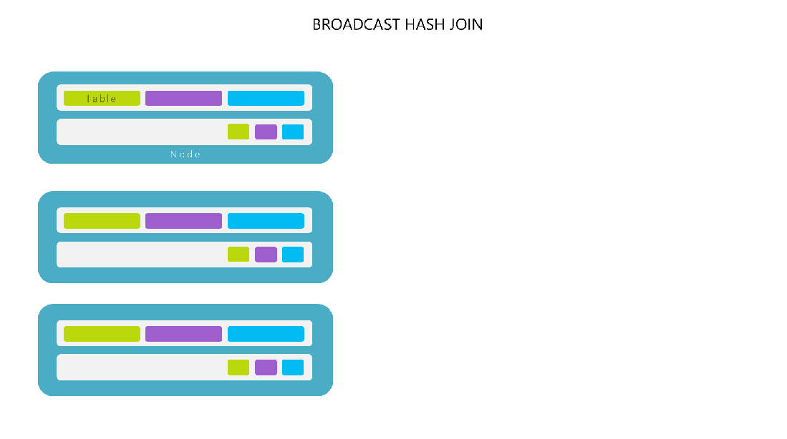

# 2.1.9 Spark Join

이번 챕터에서는 Spark DataFrame 또는 SQL 을 이용한 Join 에 대해 알아봅니다.&#x20;


사용할 데이터셋은 [Kaggle - Denver Airbnb](https://www.kaggle.com/broach/denverairbnb) 입니다. 아래와 같이 로딩 및 가공을 진행합니다.

```python
from pyspark.sql.functions import *
from pyspark.sql.types import *
from pyspark.sql.window import Window

dfListingCalendarRaw = spark.read.load("/FileStore/tables/airbnb_calendar.csv",
                                       format="csv", 
                                       inferSchema="true", 
                                       header="true")

dfListingMeta = spark.read.load("/FileStore/tables/airbnb_listings.csv",
                                format="csv", 
                                inferSchema="true", 
                                multiline = "true",
                                header="true")

dfListingReview = spark.read.load("/FileStore/tables/airbnb_reviews.csv",
                                  format="csv", 
                                  inferSchema="true", 
                                  multiline = "true",
                                  header="true")
```

```python
dfListingCalendar = dfListingCalendarRaw\
    .withColumn("price", regexp_extract(col("price"), "[0-9]+.[0-9]+", 0).cast(DoubleType()))\
    .withColumn("adjusted_price", regexp_extract(col("adjusted_price"), "[0-9]+.[0-9]+", 0).cast(DoubleType()))

dfListingCalendar.printSchema()
dfListingCalendar.toPandas()
```


데이터의 컬럼을 살펴보면 다음과 같습니다.

* dfListingCalendar 는 해당 숙소의 일별 예약 가격과 여부를 나타냅니다.
  * Airbnb Listing (숙소) 는 하위 상품이 없다고 가정합니다 (Room, RatePlan 등)
* dfListingReview 는 해당 숙소에 대한 사용자들의 리뷰를 나타냅니다.
* dfListingMeta 는 해당 숙소에 대한 메타 정보를 보여줍니다 (설명, 이름, URL 등)

```
dfListingCalendar.printSchema()
dfListingReview.printSchema()
dfListingMeta.printSchema()
```

```python
# dfListingCalendar.printSchema()
root
 |-- listing_id: integer (nullable = true)
 |-- date: timestamp (nullable = true)
 |-- available: string (nullable = true)
 |-- price: string (nullable = true)
 |-- adjusted_price: string (nullable = true)
 |-- minimum_nights: integer (nullable = true)
 |-- maximum_nights: integer (nullable = true)

# dfListingReview.printSchema()
root
 |-- listing_id: string (nullable = true)
 |-- id: string (nullable = true)
 |-- date: string (nullable = true)
 |-- reviewer_id: string (nullable = true)
 |-- reviewer_name: string (nullable = true)
 |-- comments: string (nullable = true)

# dfListingMeta.printSchema()
root
 |-- id: string (nullable = true)
 |-- listing_url: string (nullable = true)
 |-- scrape_id: string (nullable = true)
 |-- last_scraped: string (nullable = true)
 |-- name: string (nullable = true)
 |-- summary: string (nullable = true)
 |-- space: string (nullable = true)
 |-- description: string (nullable = true)
 ...
 ...
```


### Join Types


시작 전에 다양한 종류의 Join 타입에 대해서 살펴보고 넘어가겠습니다.

 (1).png>)


일반적으로는 `INNER JOIN`, `LEFT JOIN`, `(FULL) OUTER JOIN`, `CROSS JOIN` 이 많이 사용됩니다. 각각에 대해서 하나씩 살펴보겠습니다.


 (1) (1) (1) (1) (1) (1) (1) (1) (1).png>)

 (1) (1) (1) (1).png>)

 (1) (1) (1) (1) (1).png>)

 (1) (1) (1) (1) (1) (1).png>)

 (1) (1) (1) (1) (1) (1).png>)

 (1) (1) (1) (1).png>)


Spark 는 분산 처리 컴퓨팅 엔진이므로 일반적인 RDMS 보다는 조금 더 폭넓게 Join Strategy 를 지원합니다. 아래는 Spark 에서 사용 가능한 Join 과 Strategy 입니다. ([Mastering Spark SQL - Spark SQL Joins](https://jaceklaskowski.gitbooks.io/mastering-spark-sql/content/spark-sql-joins.html))

| SQL           | Name (joinType)                                                                          | JoinType      |
| ------------- | ---------------------------------------------------------------------------------------- | ------------- |
| `CROSS`       | `cross`                                                                                  | `Cross`       |
| `INNER`       | `inner`                                                                                  | `Inner`       |
| `FULL OUTER`  | `outer`, `full`, `fullouter`                                                             | `FullOuter`   |
| `LEFT ANTI`   | `leftanti`                                                                               | `LeftAnti`    |
| `LEFT OUTER`  | `leftouter`, `left`                                                                      | `LeftOuter`   |
| `LEFT SEMI`   | `leftsemi`                                                                               | `LeftSemi`    |
| `RIGHT OUTER` | `rightouter`, `right`                                                                    | `RightOuter`  |
| `NATURAL`     | Special case for `Inner`, `LeftOuter`, `RightOuter`, `FullOuter`                         | `NaturalJoin` |
| `USING`       | Special case for `Inner`, `LeftOuter`, `LeftSemi`, `RightOuter`, `FullOuter`, `LeftAnti` | `UsingJoin`   |

\
Spark Join Strategies ([Github - Spark Strategieis.scala](2.1.x-spark-join.md#join-types))

* Broadcast Hash Join
* Broadcast Nested Loop Join
* Shuffle Hash Join
* Shuffle Sort Merge Join
* Cartesian Product Join

각각에 대해서는 아래의 Join Strategy 섹션에서 살펴 보겠습니다.


### DataFrame Join&#x20;

이제 DataFrame API 를 이용해 Join 을 해보겠습니다. 다음 두 케이스들을 중심으로 코드를 작성해보겠습니다

1. `dfListingMeta` 를 기준으로 전체 기간 내 예약 수 / 판매 금액 합을 구합니다 (`available = 'f'` 인 경우를 예약이 되었다고 가정합니다.) 단 NULL 값이 예약 수와 금액 합에 없어야 합니다. NULL 일 경우 0 으로 변경합니다.
2. `dfListingMeta` 를 기준으로 월별로, **리뷰가 남은 업체에 대해서만** 리뷰 숫자를 집계합니다.
3. `dfListingCalendar` 내의 12월 일별 기간을 기준으로 **(단, 빈 날짜가 없어야 함)** 일별 예약이 있었던 업체 숫자를 집계합니다.

`dfListingMeta` 를 축으로 사용할 경우, 컬럼은 `listing_id`, `listing_name` 만 사용합니다.


#### 1. Listing 기준으로 업체 예약 수 및 판매 금액 합 구하기

```python
dfListingCalendarSales = dfListingCalendar\
    .where(col("available") == lit('f'))\
    .groupBy(col("listing_id"))\
    .agg(sum("price").alias("price_order"), count("*").alias("count_order"))
```

```python
# dfListingCalendarSales.toPandas()
# dfListingCalendarSales.show()

+----------+-----------+-----------+
|listing_id|price_order|count_order|
+----------+-----------+-----------+
|    678602|    29392.0|        300|
|   7637902|    41823.0|        365|
|   7359292|    29672.0|        303|
|   8650761|    73490.0|        358|
|   7600940|    56525.0|         88|
|   7070662|    31759.0|         91|
|   1087609|    22300.0|        194|
|   6185753|    18334.0|        204|
|   6516553|     8526.0|        203|
|   6156061|     2555.0|          5|
|   4051568|    63875.0|        365|
|   2360382|    26672.0|        355|
|   8117043|    19250.0|        110|
|  10292703|      125.0|          1|
|  11370833|     7225.0|         85|
|   2822651|    26325.0|        225|
|   8338364|       95.0|          1|
|    760023|     1690.0|         26|
|   4817072|     3303.0|         27|
|   7181062|      600.0|          6|
+----------+-----------+-----------+
```


이제 dfListingMeta 를 축으로 삼아 LEFT JOIN 을 통해 붙여보겠습니다.

* 단, 이 때 NULL 이 허용되지 않으므로 판매 금액이나 예약 숫자가 없는 경우는 0 으로 처리하기 위해 [coleasce()](https://spark.apache.org/docs/latest/api/python/reference/api/pyspark.sql.DataFrame.coalesce.html) 를 사용합니다.

```python
dfListingSales = dfListingMeta\
    .select(
        col("id").alias("listing_id"), 
        col("name").alias("listing_name"))\
    .alias("LISTING_META")\
    .join(
        other = dfListingCalendarSales.alias("LISTING_SALES"), 
        on = col("LISTING_META.listing_id") == col("LISTING_SALES.listing_id"), 
        how = "left"
    )\
    .select(
        col("LISTING_META.listing_id"), 
        col("LISTING_META.listing_name"), 
        coalesce(col("LISTING_SALES.price_order"), lit(0)).alias("price_order"), 
        coalesce(col("LISTING_SALES.count_order"), lit(0)).alias("count_order"), 
    )
    
```



특정 Join 타입에서 테이블 (DataFrame) Alias 를 지정하지 않을 경우 사용자의 의도와는 다른 결과가 나올 수 있습니다. 따라서 DataFrame 및 컬럼 사용시 alias 를 지정하는 편이 좋습니다.


만약 여러분이 위에서 나온 예제처럼이 아니라 DataFrame 의 이름을 이용하고 싶다면

* `dfListingMeta("listing_id")` 처럼 특정 DataFrame 내 컬럼을 명시적으로 지정할 수 있습니다.



이제 explain 을 해보면 다음과 같습니다. Sort Merge Join 전략이 선택되어 LEFT (OUTER) 을 하는걸 볼 수 있습니다.

```python
# dfListingSales.explain("FORMATTED")

== Physical Plan ==
AdaptiveSparkPlan (14)
+- Project (13)
   +- SortMergeJoin LeftOuter (12)
      :- Sort (4)
      :  +- Exchange (3)
      :     +- Project (2)
      :        +- Scan csv  (1)
      +- Sort (11)
         +- HashAggregate (10)
            +- Exchange (9)
               +- HashAggregate (8)
                  +- Project (7)
                     +- Filter (6)
                        +- Scan csv  (5)


(1) Scan csv 
Output [2]: [id#2732, name#2736]
Batched: false
Location: InMemoryFileIndex [dbfs:/FileStore/tables/airbnb_listings.csv]
ReadSchema: struct<id:string,name:string>

(2) Project
Output [2]: [id#2732 AS listing_id#3270, name#2736 AS listing_name#3271]
Input [2]: [id#2732, name#2736]

(3) Exchange
Input [2]: [listing_id#3270, listing_name#3271]
Arguments: hashpartitioning(cast(listing_id#3270 as int), 200), ENSURE_REQUIREMENTS, [id=#1373]

(4) Sort
Input [2]: [listing_id#3270, listing_name#3271]
Arguments: [cast(listing_id#3270 as int) ASC NULLS FIRST], false, 0

(5) Scan csv 
Output [3]: [listing_id#2718, available#2720, price#2721]
Batched: false
Location: InMemoryFileIndex [dbfs:/FileStore/tables/airbnb_calendar.csv]
PushedFilters: [IsNotNull(available), EqualTo(available,f), IsNotNull(listing_id)]
ReadSchema: struct<listing_id:int,available:string,price:string>

(6) Filter
Input [3]: [listing_id#2718, available#2720, price#2721]
Condition : ((isnotnull(available#2720) AND (available#2720 = f)) AND isnotnull(listing_id#2718))

(7) Project
Output [2]: [listing_id#2718, cast(regexp_extract(price#2721, [0-9]+.[0-9]+, 0) as double) AS price#2986]
Input [3]: [listing_id#2718, available#2720, price#2721]

(8) HashAggregate
Input [2]: [listing_id#2718, price#2986]
Keys [1]: [listing_id#2718]
Functions [2]: [partial_sum(price#2986) AS sum#3076, partial_count(1) AS count#3078L]
Aggregate Attributes [2]: [sum#3075, count#3077L]
Results [3]: [listing_id#2718, sum#3076, count#3078L]

(9) Exchange
Input [3]: [listing_id#2718, sum#3076, count#3078L]
Arguments: hashpartitioning(listing_id#2718, 200), ENSURE_REQUIREMENTS, [id=#1369]

(10) HashAggregate
Input [3]: [listing_id#2718, sum#3076, count#3078L]
Keys [1]: [listing_id#2718]
Functions [2]: [finalmerge_sum(merge sum#3076) AS sum(price#2986)#3062, finalmerge_count(merge count#3078L) AS count(1)#3064L]
Aggregate Attributes [2]: [sum(price#2986)#3062, count(1)#3064L]
Results [3]: [listing_id#2718, sum(price#2986)#3062 AS price_order#3063, count(1)#3064L AS count_order#3065L]

(11) Sort
Input [3]: [listing_id#2718, price_order#3063, count_order#3065L]
Arguments: [listing_id#2718 ASC NULLS FIRST], false, 0

(12) SortMergeJoin
Left keys [1]: [cast(listing_id#3270 as int)]
Right keys [1]: [listing_id#2718]
Join condition: None

(13) Project
Output [4]: [listing_id#3270, listing_name#3271, coalesce(price_order#3063, 0.0) AS price_order#3284, coalesce(count_order#3065L, 0) AS count_order#3285L]
Input [5]: [listing_id#3270, listing_name#3271, listing_id#2718, price_order#3063, count_order#3065L]

(14) AdaptiveSparkPlan
Output [4]: [listing_id#3270, listing_name#3271, price_order#3284, count_order#3285L]
Arguments: isFinalPlan=false
```


dfListingSales.toPandas() 또는 dfListingSales.show() 를 호출 후 Spark UI SQL 탭에서 Plan 을 보면 다음과 같습니다.

```python
# dfListingSales.show()

+----------+--------------------+-----------+-----------+
|listing_id|        listing_name|price_order|count_order|
+----------+--------------------+-----------+-----------+
|    192430|TREETOP VIEW ROOM...|    10171.0|        304|
|       360|LoHi Secret garde...|     5161.0|         40|
|     98014|Beautiful single ...|     9240.0|        154|
|       590|Comfortable  - an...|    13642.0|        249|
|     74125|Spacious Cap Hill...|    47635.0|        365|
|     39405|LoHi Secret garde...|     7314.0|         66|
|    172196|Luxury Wash Park ...|     8900.0|         25|
|    236207|Denver Penthouse ...|    52325.0|        221|
|     59631|VICTORIAN TOWNHOM...|     2682.0|         18|
|    283162|2000 SF-Lodo Club...|        0.0|          3|
|     81540|Affordable S. Den...|     8532.0|        126|
|       592|             private|     8360.0|        190|
|    217996|       Highland Snug|     3292.0|         32|
|     90307|Comfy King Size R...|    17100.0|        190|
|     56185|charming home for...|     7400.0|         24|
|    184529|HIP SUITE IN  WES...|     6965.0|        199|
|     98008|Beautiful sun fil...|    10780.0|        154|
|      1940|Baker Studio Clos...|    23507.0|        270|
|     31503|Highland Park Gue...|     2044.0|         24|
|    142683|Historic Denver C...|    38750.0|        293|
+----------+--------------------+-----------+-----------+
```

 (1).png>)


재밌는 부분은 `explain("FORMATTED")` 에서는 Sort-merge Join 전략을 사용한다고 나왔었는데, 실제로는 Broadcast Hash Join 전략을 사용해습니다. 이는 Spark 3 의 AQE ([Adaptive Query Execution](https://spark.apache.org/docs/latest/sql-performance-tuning.html#adaptive-query-execution)) 가 동작하면서 비용이 더 저렴한 Broadcast Hash Join 전략을 선택하게 된 것인데,  추후 아래의 Join Strategy 및 AQE 섹션에서 살펴 보겠습니다.


#### 2. dfListingMeta 를 기준으로 월별로, 리뷰가 남은 업체에 대해서만 리뷰 숫자를 집계하기


두번째 문제는 쉽습니다. `dfListingMeta`, `dfListingReview` 를 이용하되 INNER JOIN 을 사용하면 됩니다.

```python
dfListingReviewStat = dfListingReview\
    .groupBy(col("listing_id"))\
    .agg(count("*").alias("count_review"))
    
    
dfListingReview = dfListingMeta\
    .select(
        col("id").alias("listing_id"), 
        col("name").alias("listing_name"))\
    .alias("LISTING_META")\
    .join(
        other = dfListingReviewStat.alias("LISTING_REVIEW"), 
        on = col("LISTING_META.listing_id") == col("LISTING_REVIEW.listing_id"), 
        how = "inner"
    )\
    .select(
        col("LISTING_META.listing_id"), 
        col("LISTING_META.listing_name"), 
        coalesce(col("LISTING_REVIEW.count_review"), lit(0)).alias("count_review")
    )
    
```

```python
# dfListingReview.show()
+----------+--------------------+------------+
|listing_id|        listing_name|count_review|
+----------+--------------------+------------+
|   1143676|Modern Sizzle-New...|          35|
|   9237825|Remodeled, hip, p...|          68|
|  13204273|Cozy N. Park Hill...|         188|
|  15989734|Expansive Washing...|          56|
|  18879542|SWEET Master Suit...|           5|
|  20022219|Queen Irene's B&B...|          23|
|  20690944|Capital Hill Cond...|         102|
|  24809940|     Cute and Close!|           5|
|  26366956|Private Modern St...|          92|
|  28014823|Renovated, pictur...|          35|
|  28392632|       Lowry getaway|          89|
|  28514634|Three Bedroom, S....|          60|
|  29132612|Cosy walkout Base...|          21|
|  32985397|Beautiful Histori...|          25|
|  33491696|Single bedroom an...|           2|
|  34616832|Larimer Luxury Do...|          12|
|  36283016|Old schoolhouse 2...|           2|
|  38409657|★Amazing Home on ...|           6|
|  40141597|Spacious 2 Story ...|           1|
|   8066392|Historic Home Nea...|         102|
+----------+--------------------+------------+
```


`dfListingMeta` 와 `dfListingReview` (**INNER JOIN** 집계 결과) 를 보면, `dfListingReview` 가 더 적음을 볼 수 있습니다. 이는 **INNER JOIN** 과정에서 리뷰가 없는 숙소를 제거했기 때문입니다.

```
# dfListingMeta.count()
5157

# dfListingReview.count()
4403
```


일반적으로는 데이터가 없더라도 축이되는 Row 를 제거하지 않는 편이 좋습니다.&#x20;

* 0 일 경우는 데이터가 없다고 이해할 수 있지만
* NULL 일 경우는 데이터가 없어서인지, 아니면 집계 과정에서 코드 실수로 인해 NULL 이 나온건지 판별하기 어렵기 때문입니다.



#### 3. \`dfListingCalendar\` 내의 12월 일별 기간을 기준으로 (단, 빈 날짜가 없어야 함) 일별 예약이 있었던 업체 숫자를 집계하기


`dfListingCalender` 내에 있는 데이터가, 만약 연속적이지 않다면 어떻게 빈 날짜를 메꿀 수 있을까요?&#x20;

```python
# dfListingCalendar.agg(min("date"), max("date")).show()

+-------------------+-------------------+
|          min(date)|          max(date)|
+-------------------+-------------------+
|2019-11-29 00:00:00|2020-11-28 00:00:00|
+-------------------+-------------------+
```


[sequence()](https://spark.apache.org/docs/latest/api/sql/index.html) 함수를 이용해봅시다. 단, spark.createDataFrame 을 사용해 만드는건 번잡하니 SQL 을 이용해 봅시다.

```python
dfCalendarMeta = spark.sql("""
SELECT sequence(to_date('2020-12-01'), to_date('2020-12-31'), interval 1 day) as date
""")\
    .withColumn("date", explode(col("date")))\
    .orderBy(asc(col("date")))

```


만약 기간을 월단위로 잡고 싶다면 MONTH Interval 을 사용할 수 있습니다.

```python
dfCalendarMetaMonth = spark.sql("""
SELECT sequence(to_date('2020-01-01'), to_date('2020-12-31'), interval 1 month) as date
""")\
    .withColumn("date", explode(col("date")))\
    .orderBy(asc(col("date")))
```

```python
# dfCalendarMetaMonth.show()

+----------+
|date      |
+----------+
|2020-01-01|
|2020-02-01|
|2020-03-01|
|2020-04-01|
|2020-05-01|
|2020-06-01|
|2020-07-01|
|2020-08-01|
|2020-09-01|
|2020-10-01|
|2020-11-01|
|2020-12-01|
+----------+
```


이제 `dfListingCalendar` 내에서 일별로 예약건이 있었던 "업체 숫자" 를 구해봅시다. 다만 사전에 한 가지 변경해야 할 것은, `dfListingCalendar` 의 `date` 컬럼은 `timestamp` 타입이고 직접 만든 `dfCalendarMeta` 내의 `date` 컬럼은 `date` 타입니다. (예제의 단순함을 위해 날짜는 UTC 기준이라 가정)

```python
# dfCalendarMeta.printSchema()
root
 |-- date: date (nullable = false)

# dfListingCalendar.printSchema()
root
 |-- listing_id: integer (nullable = true)
 |-- date: timestamp (nullable = true)
 |-- available: string (nullable = true)
 |-- price: double (nullable = true)
 |-- adjusted_price: double (nullable = true)
 |-- minimum_nights: integer (nullable = true)
 |-- maximum_nights: integer (nullable = true)
```


이제 아래와 타입을 변경하고 2019. 12 월 이벤트만 필터링 해서 집계를 해보겠습니다.

```python
dateStart = "2019-12-01"
dateEnd = "2019-12-31"

dfCalendarSalesFiltered = dfListingCalendar\
    .where(col("available") == lit('f'))\
    .withColumn("date", col("date").cast(DateType()))\
    .where(col("date").between(lit(dateStart).cast(DateType()), lit(dateEnd).cast(DateType())))

dfCalendarSalesDec = dfCalendarSalesFiltered\
    .groupBy("date")\
    .agg(countDistinct("listing_id"))    
```


위의 예제에서 dateStart, dateEnd 처럼 Driver 내 변수를 Executor 에서 사용한다면 어떤 과정을 거칠까요? Serialization, Deserialization 관점에서 이야기 해보고 문제가 될 수 있을지도 생각해 봅시다.

* [Spark Broadcast Variables](https://spark.apache.org/docs/latest/rdd-programming-guide.html#broadcast-variables)



이제 `dfCalendarMeta` 에 `dfCalendarSalesDec` 를 LEFT JOIN 으로 붙이면 다음과 같습니다.

```python
dfSalesDec = dfCalendarSalesDec.alias("CALENDAR_META")\
    .join(
        dfCalendarSalesDec.alias("CALENDAR_SALES"), 
        col("CALENDAR_META.date") == col("CALENDAR_SALES.date"),
        "left"
    )\
    .select(col("CALENDAR_META.date"), coalesce(col("CALENDAR_SALES.count_uniq_listing"), lit(0)).alias("count_uniq_listing"))
```

```python
# dfSalesDec.orderBy(asc(col("date"))).show()

+----------+------------------+
|      date|count_uniq_listing|
+----------+------------------+
|2019-12-01|              3001|
|2019-12-02|              2726|
|2019-12-03|              2670|
|2019-12-04|              2706|
|2019-12-05|              2951|
|2019-12-06|              3182|
|2019-12-07|              3238|
|2019-12-08|              2872|
|2019-12-09|              2691|
|2019-12-10|              2635|
|2019-12-11|              2607|
|2019-12-12|              2760|
|2019-12-13|              2906|
|2019-12-14|              2886|
|2019-12-15|              2645|
|2019-12-16|              2439|
|2019-12-17|              2362|
|2019-12-18|              2339|
|2019-12-19|              2403|
|2019-12-20|              2521|
+----------+------------------+

```


### SQL Table Join

SQL Join 은 내부 동작은 DataFrame 과 동일하기 떄문에, SQL-specific 한 부분만 짚고 넘어가도록 하겠습니다.


지난 챕터에서의 샘플과 [Spark SQL - Join](https://spark.apache.org/docs/latest/sql-ref-syntax-qry-select-join.html) 에서 볼 수 있듯이 SQL 로 Join 이 가능합니다. Spark 버전이 3 가 되면서 SQL Join 부분에 변화가 있다면, Broadcast Join 이외에도 다른 타입의 힌트가 지원이 된다는 점 입니다.&#x20;

* BROADCAST
  * 힌트 사용시 autoBroadcastJoinThreshold 옵션을 무시하고 동작합니다.
* MERGE (SHUFFLE\_MERGE  과 동일)
  * &#x20;Sort-mege 조인을 사용합니다
* SHUFFLE\_HASH
* SHUFFLE\_REPLICATE\_NL


만약 JOIN 대상 양쪽 테이블에 Join 을 위한 다른 Hint 가 각각 지정된다면 Spark 는 다음의 우선순위를 이용해 결정합니다.

* BROADCAST > MERGE > SHUFFLE\_HASH > SHUFFLE\_REPLICATE\_NL&#x20;
* 양쪽 테이블에 모두 똑같은 Join Hint 가 지정된다면 (Broadcast 및 Shuffle Hash) Spark 는 테이블의 사이즈를 고려해 작은쪽을 기반 테이블로 사용합니다.


SQL 힌트는 다음처럼 제공할 수 있습니다.&#x20;

```sql
-- Join Hints for broadcast join
SELECT /*+ BROADCAST(t1) */ * FROM t1 INNER JOIN t2 ON t1.key = t2.key;
SELECT /*+ BROADCASTJOIN (t1) */ * FROM t1 left JOIN t2 ON t1.key = t2.key;
SELECT /*+ MAPJOIN(t2) */ * FROM t1 right JOIN t2 ON t1.key = t2.key;

-- Join Hints for shuffle sort merge join
SELECT /*+ SHUFFLE_MERGE(t1) */ * FROM t1 INNER JOIN t2 ON t1.key = t2.key;
SELECT /*+ MERGEJOIN(t2) */ * FROM t1 INNER JOIN t2 ON t1.key = t2.key;
SELECT /*+ MERGE(t1) */ * FROM t1 INNER JOIN t2 ON t1.key = t2.key;

-- Join Hints for shuffle hash join
SELECT /*+ SHUFFLE_HASH(t1) */ * FROM t1 INNER JOIN t2 ON t1.key = t2.key;

-- Join Hints for shuffle-and-replicate nested loop join
SELECT /*+ SHUFFLE_REPLICATE_NL(t1) */ * FROM t1 INNER JOIN t2 ON t1.key = t2.key;

-- When different join strategy hints are specified on both sides of a join, Spark
-- prioritizes the BROADCAST hint over the MERGE hint over the SHUFFLE_HASH hint
-- over the SHUFFLE_REPLICATE_NL hint.
-- Spark will issue Warning in the following example
-- org.apache.spark.sql.catalyst.analysis.HintErrorLogger: Hint (strategy=merge)
-- is overridden by another hint and will not take effect.
SELECT /*+ BROADCAST(t1), MERGE(t1, t2) */ * FROM t1 INNER JOIN t2 ON t1.key = t2.key;
```



Spark SQL 을 이용해 다음 집계를 수행해봅시다

* 각 업체에 대해 2020년 1월부터 2020년 12월까지 빈 월이 없도록 축을 만들고 (CROSS JOIN)
* 리뷰의 월별 누적 집계를 구해봅시다. (Window Function)



### Join Strategy

이제 각 조인 전략의 동작 방식에 대해 알아보겠습니다. Spark 에서는 사용자가 직접 Hint 로 지정하지 않는 경우 Join 시 양 테이블의 데이터 사이즈를 고려해 최적화된 Join 전략을 사용합니다.


 (1) (1) (1).png>)


`=` 를 이용한 동등 조인 (Equi) 일 경우와 아닐 경우에 따라 사용할 수 있는 Join 전략이 다릅니다.&#x20;

* Equi Join 의 경우 Broadcast, Shuffle Hash, Sort Merge, Shuffle Replicate NL 전략이 사용 가능합니다
* Non Equi Join 의 경우 Broadcast, Shuffle Replicate NL 전략만 사용이 가능합니다.


우선 Join 과정에서 가장 먼저 생각해야 할 것은, "데이터의 이동" 입니다.&#x20;

* 즉 데이터를 어떻게 이동시킬것이냐에 따라 Broadcast / Shuffle 방식이 구분됩니다.&#x20;
* 그리고 그 이후에 Hash, Sort-merge, Nested Loop 등 구체적인 Join 알고리즘이 구분이 됩니다.


 (1) (1) (1) (1).png>)




Broadcast 방식은 작은 사이즈의 테이블 (DataFrame) 을 Driver 를 거쳐 각 Worker 노드에 전부 뿌린 뒤 Shuffle 없이 Join 을 진행합니다.

* 따라서 Broadcast 되는 대상 테이블이 크다면 Driver 의 메모리가 터질 수 있습니다
* Shuffle 이 없으므로 네트워크를 통한 데이터 이동이 없어 Join 속도가 매우 빠릅니다


 (1) (1) (1) (1) (1) (1).png>)


반면 Shuffle 을 이용한 Join 은 데이터를 각 노드마다 이동 시키므로 네트워크 비용이 들어 속도가 느린 반면 큰 데이터까지 Join 할 수 있습니다.


Spark 3.2.0 의 [spark.sql.execution.SparkStrategies](https://github.com/apache/spark/blob/d90b47918504bf9cec99350b68f62aee9686fa70/sql/core/src/main/scala/org/apache/spark/sql/execution/SparkStrategies.scala#L109-L140) 파일을 살펴보면, Spark 는 5 가지의 Join 을 지원함을 알 수 있습니다.

| Join Type                                                                |                              |                                     |
| ------------------------------------------------------------------------ | ---------------------------- | ----------------------------------- |
| Broadcast Hash Join                                                      | Equi Join                    | All Join Types (Full Outer Join 제외) |
| Shuffle Hash Join                                                        | Equi Join                    | All Join Types                      |
| Shuffle Sort Merge Join                                                  | Equi Join, Sortable Join Key | All Join Types                      |
| Broadcast nested Loop Join                                               | Equi, Non-equi               | All Join Types                      |
| <p>Shuffle Replicate Nested Loop Join</p><p>(Cartesian Product Join)</p> | Equi, Non-equi               | Inner Like Joins only               |


Join 전략에 따라서 지원되는 Join 종류와 (Left, Full Outer 등) Join 키가 다 다릅니다. 그리고 특정 옵션의 여부도 Join 전략 사용에 영향을 줍니다.&#x20;

* 예를 들어 Spark 3 부터는 Cross Join (Cartesian Product) 를 사용하기 위한 옵션인 `spark.sql.crossJoin.enabled` 이 자동으로 활성화 되어 있습니다. ([SPARK-28621](2.1.x-spark-join.md#join-types))
* `spark.sql.autoBroadcastJoinThreshold` 값은 기본으로 10 MiB 입니다. 만약 이 값을 `-1` 로 세팅하면 Brodacast Join 을 비활성화 합니다.
* `spark.sql.broadcastTimeout` = 300 (초) 는 Broadcast Timeout 입니다
* `spark.sql.shuffle.partitions` 옵션은 Join 또는 Aggregation 을 위한 Shuffle 발생시 사용할 파티션 숫자를 지정합니다.


이러한 Join 전략들은 일반적인 RDB 에서도 일부 지원됩니다. 다만 다루는 데이터의 크기와 Latency 가 다르므로 지원되는 전략이 다를 수 있습니다.

* MySQL 의 경우에는 8.0.18+ 부터 Nested Loop 뿐만 아니라 Hash Join 을 지원합니다.


Hash Join 을 조금 더 알아보겠습니다.

 (1) (1) (1) (1) (1) (1) (1) (1).png>)

작은 데이터 셋의 키를 조회하면서 자주 접근될 메모리에 Hash 셋을 만들고, 큰 테이블을 순회하면서 Hash 셋을 조회하면서 조인합니다.


#### 1. Broadcast Hash Join


 (1) (1) (1) (1) (1).png>)

 (1) (1) (1) (1) (1).png>)


Broadcast Hash Join 은 작은 데이터셋을 Broadcast 한 후에 Executor 에서 Hash Join 을 수행합니다.

* Broadcast Hash Join 은 사용자가 [SQL Join Hint](2.1.x-spark-join.md#join-strategy) 를 지정하거나 지정하지 않았더라도 한쪽 테이블의 사이즈가 `spark.sql.autoBroadcastJoinThreshold = 10 MiB` (Default) 보다 작으면 실행됩니다
* Broadcast 될 대상 테이블이 클 경우 Driver 를 거쳐서 Broadcasting 이 발생하므로 Driver OOM 또는 해시 테이블로 인한 Executor OOM 이 발생할 수 있습니다.&#x20;
* 그러나 한쪽 데이터의 사이즈가 매우 작다면 Shuffle 이 발생하지 않고 상대적으로 적은 양의 데이터만 Executor 로 이동하면 되므로 네트워크 비용이 매우 저렴합니다.&#x20;


2\. Shuffle Hash Join

 (1) (1) (1) (1) (1) (1).png>)

 (1) (1) (1) (1) (1).png>)


Shuffle Hash Join 은 Shuffle 을 발생시켜 데이터를 이동한 뒤 Hash Join 을 수행합니다.

* 작은 쪽, 즉 메모리에 Hash 셋을 만들 테이블은 `spark.sql.autoBroadcastJoinThreshold` (10 MiB, Default ) \* `spark.sql.shuffle.partitions` (200, Default) = 2 GiB 보다 작아야 합니다.
* Spark 1.6 에서 ([SPARK-11675](https://issues.apache.org/jira/browse/SPARK-11675)) 제거되었으나 Spark 2.0 에서 ([SPARK-13977](https://issues.apache.org/jira/browse/SPARK-13977)) 다시 추가되었습니다.
* Spark 2.3 부터는 Shuffle Hash Join 대신 Shuffle Sort Merge Join 이 기본 전략으로 세팅되어 있습니다. (`spark.sql.join.preferSortMergeJoin` = true, Default)


Shuffle Hash Join 은 큰 데이터셋을 다룰 수 있으나 Hash 셋을 빌드할때 메모리에 올려야 하므로 너무 크다면 Executor OOM 이 발생할 수 있습니다.



Shuffle Hash Join 과정에서 OOM 이 발생할 경우 어떻게 하면 OOM 을 방지할 수 있을까요?

* `spark.sql.shuffle.partitions` 옵션을 바탕으로 생각해봅시다.



#### 3. Shuffle Sort Merge Join

 (1) (1) (1) (1).png>)


 (1) (1) (1) (1) (1).png>)


Shuffle Sort Merge Join 은 데이터를 Shuffle 시켜 정렬한 후 (Sort) Join 을 수행합니다.&#x20;

* Spark 2.3 부터 `spark.sql.join.preferSortMergeJoin = true`활성화 되어있어, 큰 데이터셋에 대해 주로 사용됩니다
* 다만 이름에서 알 수 있듯이 Join Key 가 정렬 가능해야 합니다
* Join 과정에서 Shuffle Hash Join 과 달리 Memory 가 아닌 Disk 를 이용할 수 있기 때문에 OOM 이 발생하지 않습니다 ([SortMergeJoinExec](https://jaceklaskowski.gitbooks.io/mastering-spark-sql/content/spark-sql-SparkPlan-ShuffledHashJoinExec.html), [ExternalAppendOnlyUnsafeRowArray](https://jaceklaskowski.gitbooks.io/mastering-spark-sql/content/spark-sql-ExternalAppendOnlyUnsafeRowArray.html))

 (1) (1) (1) (1) (1).png>)


#### 4. Broadcast Nested Loop Join

 (1) (1) (1) (1).png>)

Broadcast Nested Loop Join 은 선택할수 있는 전략이 없을 경우 마지막으로 선택되는 Join 전략입니다. Broadcast Nested Loop 는 작은 데이터셋을 Broadcast 한 후 이중 반복문을 돌며 하나씩 데이터를 비교해 Join 하는 방식입니다.



정렬이 되어있지 않은 Nested Loop 방식과 정렬이 되어있는 Sort Merge 방식은 어떤 차이점이 있을까요?



#### 5. Cartesian Join

 (1) (1) (1) (1) (1).png>)


Cross Join 은 키가 지정되지 않을 경우 사용되며, Cross Join 사용을 위해서는 `spark.sql.crossJoin.enabled=true` 옵션이 활성화 되어야있어야 합니다.


### Adaptive Query Execution


Spark 의 Cost-based Optimizer (CBO) 는 Data 에 Row 등 각종 통계를 바탕으로 더 나은 실행 계획을 결정하도록 돕습니다. 예를 들어 Broadcast Hash Join 대신 Sort Merge Join 을 사용하거나, Hash Join 일 경우 Build Side (메모리에 해싱되어 올라갈 쪽) 을 정할 수 있습니다.

그러나 항상 모든 시점에 최신값의 데이터에 대한 통계를 이용할 수 있는것은 아니며 이런 부정확한 통계값들은 최적의 실행계획을 만드는데 도움이 되진 못했습니다.

Spark 3.0 부터는 Adaptive Query Execution (이하 AQE) 추가 되었고, 이 기능으로 인해 더 나은 실행 계획을 사용자의 간섭 없이 Spark 가 자동적으로 만들 수 있습니다.

 (1) (1) (1) (1).png>)


Spark Stage 가 실행되면서 중간중간 AQE 는 종료된 Stage 를 바탕으로 런타임 통계를 업데이트하고, 이 통계 정보를 바탕으로 다시 최적화를 수행합니다. Spark 3.0 에서는 AQE 의 3가지 기능이 포함되었습니다.

* Dynamic Coalescing Shuffle Partitions
* Dynamically Switching Joni Strategies
* Dynamically Optimizing Skew Joins

 (1) (1) (1).png>)


AQE 사용을 위해서는 Spark 3.0+ 에서 `spark.sql.adaptive.enabled` 활성화 되어 있어야 합니다. (Default = true)


[Spark Performance Tuning](https://spark.apache.org/docs/latest/sql-performance-tuning.html#adaptive-query-execution) 문서에서 AQE 관련 설정을 볼 수 있습니다.


#### 1. Dynamic Coalescing Shuffle Partitions


 (1) (1) (1) (1) (1) (1).png>)


 (1) (1) (1).png>)


Aggregation 과정에서 발생하는 Shuffle 은 네트워크 데이터 전송 및 Disk 쓰기 포함하기 때문에 굉장히 비싼 연산입니다.  spark.sql.shuffle.partitions 는 기본값 200 으로 작은 데이터셋에 대해서는 매우 큰 숫자인데, AQE 를 통해 파티션을 병합하고 성능을 높일 수 있습니다.&#x20;

위의 그림에서는 Mapping Stage 에서 더 적은 수의 Partition 을 만들어 내며 그로인해 Reducer 숫자가 줄어든 것을 볼 수 있습니다.



Partition 의 숫자는 Shuffle 에 어떤 영향을 미칠까요? [Databricks Blog 의 AQE 설명](https://databricks.com/blog/2020/05/29/adaptive-query-execution-speeding-up-spark-sql-at-runtime.html)을 보면서 이야기를 나누어 봅시다.


1. If there are too few partitions, then the data size of each partition may be very large, and the tasks to process these large partitions may need to spill data to disk (e.g., when sort or aggregate is involved) and, as a result, slow down the query.
2. If there are too many partitions, then the data size of each partition may be very small, and there will be a lot of small network data fetches to read the shuffle blocks, which can also slow down the query because of the inefficient I/O pattern. Having a large number of tasks also puts more burden on the Spark task scheduler.



 (1) (1) (1).png>)

 (1) (1).png>)


#### 2. Dynamically Switching Join Strategies


 (1) (1) (1) (1).png>)

 (1) (1) (1) (1).png>)


앞서 언급했던 것처럼, Build Side 의 사이즈가 작다면 일반적으로는 Broadcast Hash Join 이 가장 성능이 좋습니다. Spark 는 Broadcast Hash Join 을 위해 Threshold (Size) 설정을 사용하는데, 추정된 테이블 사이즈가 실제로는 더 작은 경우가 종종 있습니다.

AQE 는 정확한 Relation (테이블) Size 를 바탕으로 Broadcast Hash Join 이 가능한지 체크하고, 가능할 경우 Sort Merge Join 을 Broadcast Hash Join 으로 변경합니다.

위 그림에서는 Stage 2 를 실행 후 판별해보니 Broadcast 가 더 나을것 같아 이미 실행된 결과가 있음에도 (Map-side Shuffle Write) Broadcast Join 으로 변경하는 것을 보여줍니다.

> AQE converts sort-merge join to broadcast hash join when the runtime statistics of any join side is smaller than the adaptive broadcast hash join threshold. **This is not as efficient as planning a broadcast hash join in the first place, but it’s better than keep doing the sort-merge join**, as we can save the sorting of both the join sides, and read shuffle files locally to save network traffic(if `spark.sql.adaptive.localShuffleReader.enabled` is true)


 (1) (1) (1) (1) (1).png>)


#### 3. Dynamically Optimizing Skew Joins

 (1) (1).png>)

 (1) (1) (1) (1) (1).png>)

.png>)


AQE 는 런타임에 Shuffle 파일의 통계 정보를 바탕으로 Skew 를 일으키는 큰 파티션이 있을 경우 분할합니다. 위 사진에서는 A0 파티션이 상대적으로 커 Skew 를 일으킬 수가 있고, 이것이 AQE 에 의해 A0-1, A0-2 로 분할 된 것을 볼 수 있습니다.


### Summary

아래는 이번 시간에 다룬 핵심 키워드들 입니다.

* Broadcast Hash Join
* Broadcast Nested Loop Join
* Shuffle Hash Join
* Shuffle Sort Merge Join
* Cartesian Product Join
* AQE

