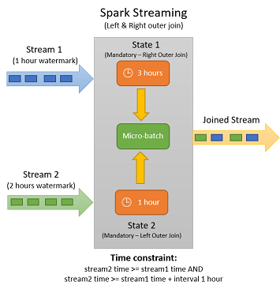

# 2.4.5 Streaming State

이번 챕터에서는 State 를 어떻게 만들고, State 가 Spark Streaming 에서 관리되는지를 알아봅니다.


### Streaming State

State 는 Spark 가 Executor 메모리에 유지하는 '상태' 를 말합니다. 다음 연산들을 사용할 경우에 State 가 만들어집니다.

* Join
* Aggregation
* Window
* Arbitrary Stateful Operation


Join, Aggregation (Group By), Window 의 경우에는 사용자가 Spark 의 함수를 사용해서 State 를 비명시적으로 만들게 됩니다.


Arbitrary Stateful Operation 이란 사용자가 명시적으로 '**State**' 를 만드는 방법입니다. Direct Streaming / Structured Streaming 각각 다음의 API 를 이용할 수 있습니다.

* (Direct Streaming) [DStream.updateStateByKey](https://spark.apache.org/docs/latest/streaming-programming-guide.html#updatestatebykey-operation), [DStream.mapWithState](https://github.com/apache/spark/blob/master/examples/src/main/scala/org/apache/spark/examples/streaming/StatefulNetworkWordCount.scala#L69)
* (Structured Streaming) [mapGroupsWithState / flatMapGroupsWithState](https://spark.apache.org/docs/latest/structured-streaming-programming-guide.html#arbitrary-stateful-operations)
  * [Scala API](https://spark.apache.org/docs/latest/api/scala/org/apache/spark/sql/streaming/GroupState.html)
  * [Scala Session Example](https://github.com/apache/spark/blob/v3.2.0/examples/src/main/scala/org/apache/spark/examples/sql/streaming/StructuredSessionization.scala)



DStream 에서는 1.6 이후 로 mapWithState API 가 추가되었습니다. updateStateByKey 와 어떤 차이점이 있는지 다음 문서를 통해 알아봅시다.

* [Spark Stateful Stream Processing with mapWithState](https://www.linkedin.com/pulse/spark-stateful-stream-processing-mapwithstate-ajay-mall)
* [Exploring Stateful Streaming with Apache Spark](https://blog.yuvalitzchakov.com/exploring-stateful-streaming-with-apache-spark/)





.png>)

사용자가 State 가 없는 연산 (단순 Filter, Map 등) 을 수행하는 것이 아니라 Join, Aggtegation, Window 를 통해 비명시적으로 혹은 `mapGroupsWithState` 와 같은 함수를 통해 명시적으로 State 를 사용할때 State 는 Executor 의 메모리에 존재합니다.&#x20;

* _**만약 이 때 Executor 가 죽는다면 State 는 날라가서 복구되지 못하는 걸까요?**_
* **또한 State 가 과하면 OOM 이 발생하지 않을지도 같이 이야기 해 봅시다.**


### Checkpoint

**Checkpoint** 게임에서의 'Save Point' 와 비슷하게 Spark Streaming Application 이 특정 시점의 데이터를 기록해놓는 것입니다.


Spark Structured Streaming 에서는 `checkpointLocation` 옵션을 통해 checkpoint 경로를 지정할 수 있습니다.

```scala
ds
  .writeStream
  .format("parquet")
  .option("checkpointLocation", "s3://...")
```


이 때 Checkpoint 에 기록되는 데이터는 크게 2가지로 나눌 수 있습니다.

* Data (State)
* Metadata (Kafka Offset 등)


.png>)


Spark Streaming Application 은 기본적으로 Micro Batch 로 동작하기 때문에 이전 Batch 의 Data(State) 와 Metadata (Kafka Offset 등) 을 Checkpoint 에 기록합니다. 이를 통해

* 다음 Micro-batch 에서 이전 State 를 읽어 현재 Micro-batch 에서의 데이터와 더해 State 를 갱신하고
* Executor Failure 와 같은 문제 상황 발생시 State 를 복구할 수 있도록 설계되었습니다.


사용자가 만든 State 에 사용자 ID 와 상품 방문 숫자가 저장된다면, Micro-batch 간의 다음과 같이 도식화 할 수 있습니다.

.png>)

State 는 단순히 Key-Values 의 나열일 뿐입니다. Spark Streaming 내부적으로는 [StateStore](https://jaceklaskowski.gitbooks.io/spark-structured-streaming/content/spark-sql-streaming-StateStore.html) 라는 개념을 통해 State 의 관리를 지원합니다.

사용자가 명시적으로 ([mapGroupsWithState](https://jaceklaskowski.gitbooks.io/spark-structured-streaming/content/spark-sql-streaming-KeyValueGroupedDataset-mapGroupsWithState.html) 등) 생성하거나 암시적으로 (Join, Window, Deduplication) 생성하는 State 는 이곳에 저장되며 증분 방식으로 Checkpoint 를 남길 수 있습니다.

\
`spark.readStream.format("rate")` 를 이용하면 시간과 증가하는 정수값을 자동으로 생성하는 스트림 소스를 만들 수 있습니다. 아래 코드는 GroupBy 사용시 **StateStoreSave** 가 Plan 에 포함되는 것을 보여줍니다.

```scala
scala> val dsRate = spark.readStream.format("rate").load
dsRate: org.apache.spark.sql.DataFrame = [timestamp: timestamp, value: bigint]

scala> val dsGrouped = dsRate.groupBy($"value" % 10).count()
dsGrouped: org.apache.spark.sql.DataFrame = [(value % 10): bigint, count: bigint]
```

```scala
scala> dsGrouped.explain("formatted")
== Physical Plan ==
* HashAggregate (9)
+- StateStoreSave (8)
   +- * HashAggregate (7)
      +- StateStoreRestore (6)
         +- * HashAggregate (5)
            +- Exchange (4)
               +- * HashAggregate (3)
                  +- * Project (2)
                     +- StreamingRelation (1)
```


Spark Structured Streaming 은 Spark Batch 에서 사용하는 Dataset, DataFrame 의 API 를 거의 동일하게 제공하고 마찬가지로 Optimizer 를 통해 최적화되므로 위와 같이 explain() 을 이용해 실행 계획을 볼 수 있습니다.

Spark Batch 와 동일하게 실행 계획이 만들어지며, 차이점은 결과물이 단일 실행이 아니라 시간에 따라 연속적으로 실행되는 Micro-batch 가 된다는 점입니다.

.png>)


이전에 만들었던 숫자를 Group By 하는 쿼리를 아래 커맨드를 통해 Spark Shell 에서 실행해볼 수 있습니다.

```
val streaming = dsGrouped.writeStream.format("console").outputMode("complete").option("checkpointLocation", "/tmp/spark-streaming/count").option("truncate", "false").start()
```


터미널 내에서 만들어진 Checkpoint 디렉토리를 살펴보면 다음과 같습니다.

```scala
    ├── commits
    │   ├── 0
    │   ├── 1
    │   ├── 2
    │   ├── 3
    │   └── 4
    ├── metadata
    ├── offsets
    │   ├── 0
    │   ├── 1
    │   ├── 2
    │   ├── 3
    │   ├── 4
    │   └── 5
    ├── sources
    │   └── 0
    │       └── 0
    └── state
        └── 0
            ├── 0
            │   ├── 1.delta
            │   ├── 2.delta
            │   ├── 3.delta
            │   ├── 4.delta
            │   ├── 5.delta
            │   ├── 6.delta
            │   └── _metadata
            │       └── schema

     .... (생략)
```

```
$ cat state/0/0/_metadata/schema

v2g{"type":"struct","fields":[{"name":"_groupingexpression","type":"long","nullable":true,"metadata":{}}]}Z{"type":"struct","fields":[{"name":"count","type":"long","nullable":false,"metadata":{}}]}%
```


위 내용을 보면 State 가 저장되는 디렉토리와 그 파일 구조를 확인할 수 있습니다.

* `state/{operatorId=0}/{partitionId=0}/{version}.delta` 형식으로 기록됩니다.
* 즉 [6.delta](http://6.delta) 는 해당 파티션 내 State 의 6번째 버전입니다.

[StateStore.storeCheckpointLocation](https://github.com/apache/spark/blob/094300fa609e3028e29346641baae7174ca9a1c8/sql/core/src/main/scala/org/apache/spark/sql/execution/streaming/state/StateStore.scala#L389-L394)  를 살펴보면 아래와 같이 디렉토리 경로가 결정됨을 볼 수 있는데,  operatorId / partitionId 를 통해 경로가 정해집니다.

```scala
/**
 * Checkpoint directory to be used by a single state store, identified uniquely by the tuple
 * (operatorId, partitionId, storeName). All implementations of [[StateStoreProvider]] should
 * use this path for saving state data, as this ensures that distinct stores will write to
 * different locations.
 */
def storeCheckpointLocation(): Path = {
  if (storeName == StateStoreId.DEFAULT_STORE_NAME) {
    // For reading state store data that was generated before store names were used (Spark <= 2.2)
    new Path(checkpointRootLocation, s"$operatorId/$partitionId")
  } else {
    new Path(checkpointRootLocation, s"$operatorId/$partitionId/$storeName")
  }
}
```


실제로 spark.sql.shuffle.partitions 의 기본값은 200 이고, 이로 인해 200 개의 파티션의 각각 State 가 디렉토리별로 생성된 것을 볼 수 있습니다.

```shell
$ ls -al state/0 | tail -n5

195
196
197
198
199


$ ls state/0 | wc -l

200
```


### Checkpoint: Commit and Offset

이제 State 이외의 다른 어떤 내용들이 Checkpoint 에 저장되는지 한번 살펴 보겠습니다.


.png>)


아까 위에서 만들어진 Checkpoint 내 디렉토리 목록을 다시 살펴보면 다음과 같습니다.

```bash
$ tree . -L 1
.
├── commits
├── metadata
├── offsets
├── sources
└── state      # state 저장을 위한 디렉토리
```


.png>)

위 그림에서 말하는 Metadata 를 Checkpoint 내 디렉토리로 보면 commits , offsets 가 해당됩니다.


Spark Structured Streaming 은 각 Micro-batch 마다 ID 가 존재합니다. (**batchId** = 0 부터 시작)

* N 번째 배치에서는 먼저 `offsets/N` 파일이 만들어지고 여기에 필요한 메타데이터를 남깁니다. (**WAL**, Write-ahead LOG)
  * Kafka Source 를 사용한다면, 해당 Task 를 위한 Kafka Offset 이 `{partitionId: offset}` 구조로 남습니다.
* N 번째 배치를 수행하기 위해 `state/{operatorId}/{partitionId}/N` 상태 파일을 읽습니다.
* 상태 파일은 1 부터 시작하므로 **N** 번째 상태 파일은 **N-1** 번의 batchId 에서 실행된 결과입니다.
* 그리고 처리가 완료되면 `commits/N` 디렉토리에 처리한 결과에 대한 메타데이터를 남깁니다.


그림으로 표현하면 다음과 같습니다.

.png>)


6번의 **batchID** 를 가진 Micro-batch 를 수행할 경우

1. 먼저 Offset 파일을 만들고 (`offsets/6`)
2. State 파일을 읽어 처리하고 (`state/6`)
3. 처리가 완료되면 Commit 파일을 만듭니다. (`commits/6`)

따라서 commits 디렉토리 내 batchId 가 존재하면, 해당 Micro-batch 는 작업이 완료된 것입니다.



이렇게 만들어진 수 많은 작은 파일들은 언제 삭제될까요? Spark Streaming 에서는 이 파일들의 Compaction 과 삭제를 위한 인터널 옵션을 제공합니다.


```
"spark.sql.streaming.minBatchesToRetain" // default 100
"spark.sql.streaming.fileSink.log.compactInterval" // default 10
"spark.sql.streaming.fileSource.log.compactInterval" // default 10
```


HDFS Retention / S3 Life-cycle 등을 통해 Checkpoint File 들을 제거할 수 있습니다. 만약 Checkpoint 파일들이 지워지지 않는다면, 작은 파일들이 여럿 생겨 스토리지에 부하를 주거나 양이 많아져 비용 문제가 될 수 있습니다.



지금까지 설명한 Checkpoint 에 대한 내용을 하나의 그림으로 표현해보면 아래와 같이 시각화 할 수 있습니다.

.png>)


### Checkpoint and State Storage

체크포인트는 Executor 복구시에 사용할 수 있어야 하므로 기본적으로는 HDFS / S3 등 분산 저장소에 기록해 놓습니다. 다만 위에서와 같이 로컬 디버깅 / 테스트 목적등을 위해 머신 로컬 파일 내에 기록할 수도 있습니다.

State 또한 기본적으로는 [HDFSBackedStateStore](https://jaceklaskowski.gitbooks.io/spark-structured-streaming/content/spark-sql-streaming-HDFSBackedStateStore.html) 를 사용합니다. (S3-compatible)

그러나 HDFSBackedStateStore 의 경우에는 큰 State 를 사용할 경우 읽었다 내리면서 과도한 GC 로 인해 Micro-batch 처리 시간에 영향을 많이 주게 됩니다. 이는 HDFSBackedStateStore 는 Executor 의 JVM 메모리 내에 State 를 유지하기 때문입니다.

Spark 3.2.0 부터는 Built-in 으로 [RocksDB State Store](https://spark.apache.org/docs/latest/structured-streaming-programming-guide.html#rocksdb-state-store-implementation) 를 지원합니다. RocksDB StateStore 는 Native Memory (JVM 영억 외부 = Off-heap) 와 Executor 의 Local Disk 를 사용해 State 를 관리합니다. 이로 인해 GC 의 영향을 받지 않습니다.

```scala
spark.conf.set(
  "spark.sql.streaming.stateStore.providerClass",
  "org.apache.spark.sql.execution.streaming.state.RocksDBStateStoreProvider")
```


### State and Checkpoint


State 를 Checkpoint 에 저장할 경우 복구 및 재시작시 Application Code 를 State 호환성이 없도록 변경할 경우 기존 State 를 사용할 수 없으므로 사용에 매우 주의하여야 합니다.

* [Recovery Semantics after Changes in a Streaming Query](https://spark.apache.org/docs/latest/structured-streaming-programming-guide.html#recovery-semantics-after-changes-in-a-streaming-query)
* _**매우 중요하니 전체 섹션을 읽어볼 것을 권장합니다.**_

_****_

예를 들어, 다음의 변경 사항은 기존의 Checkpoint 를 쓸 수 없도록 만듭니다.

* Source (readStream) 에서 Kafka Topic 을 변경이 불가능합니다. (not allowed as the results are unpredictable)
* Sink (writeStream) 에서 Kafka 를 foreach 로 변경이 불가능합니다.
* Filter (where, filter 함수) 를 추가하거나 삭제하는 것은 가능합니다.
* Projeciton 은 동일한 Output Schema 일 경우에만 가능합니다. (selectExpr(x as a) => selectExpr(y as b))
* Group By 에 새로운 키를 추가하는 것은 불가능합니다. (groupBy("a", "b"))
* Streaming 에서 dropDuplicates 사용시 키를 추가하는 것은 불가능합니다.
* mapGroupsWithState / flatMapGroupsWithState 사용시 (Arbitrary Stateful Operation) 사용자가 지정한 State Schema (Case Class) 는 변경이 불가능합니다.

> If you really want to support state schema changes, then you can explicitly encode/decode your complex state data structures into bytes using an encoding/decoding scheme that supports schema migration. For example, if you save your state as Avro-encoded bytes, then you are free to change the Avro-state-schema between query restarts as the binary state will always be restored successfully.  ([Recovery Semantics after Changes in a Streaming Query](https://spark.apache.org/docs/latest/structured-streaming-programming-guide.html#recovery-semantics-after-changes-in-a-streaming-query))



Flink Streaming Framework 는 사용자 생성 스키마 (Arbitrary Stateful Operation in case of Spark) 의 일부 변경을 허용합니다.

* [State Schema Evolution | Apache Flink](https://nightlies.apache.org/flink/flink-docs-master/docs/dev/datastream/fault-tolerance/serialization/schema\_evolution/)



### Kafka Offset Checkpoint

이 섹션에서는 Structured Streaming 에서 Kafka 를 사용할 경우 Offset 이 어떻게 Checkpoint 에서 관리되는지 살펴봅니다.


Spark Streaming 과 같은 분산 처리 스트리밍 프레임워크는 문제 상황시 자체 복구나 Exactly-once Processing 을 위해 일반적으로 Kafka Offset 을 직접 관리합니다. (Spark, Druid, Flink 등) 즉, 일반적인 Kafka Consumer 와는 다르게 Kafka Offset 을 \_\_consumer\_offset Topic 으로 보내지 않으며 Checkpoint 파일 내에 Offset 을 기록합니다.


.png>)


Structured Streaming 에서 Kafka Offset 을 소비하는 방식은 다음과 같습니다.

* 최초 실행시 Spark Driver 가 Kafka Broker 에서 `startingOffsets` (earliest, latest) 을 시작점으로 잡아 Offset 을 가져옵니다.
* 이후부터는 Checkpoint 내 `offsets` 디렉토리를 바탕으로 판별합니다. `startingOffsets` 를 사용하지 않습니다.
* Spark Driver 는 Kafka 로 부터 지정된 Offset 을 시작점으로 잡아 전체 Kafka Topic Partition 에서 `maxOffsetsPerTrigger` 만큼 가져옵니다. (default = 미지정)
* Spark Driver 는 Kafka Topic 의 Partition Offset 값들을 **(Kafka Partition, minOffset, maxOffset)** 과 같이 만들어 Executor 에게 최대한 균등하게 뿌립니다.
  * 만약 이번 Micro-batch 에서 새롭게 생성된 Kafka Topic 내 Partition 을 발견한다면 earliest Offset 을 사용합니다.
* Spark Executor 들은 Driver 로 부터 받은 **(Kafka Partition, minOffset, maxOffset)** 값을 바탕으로 Kafka Broker 로 부터 데이터를 가져옵니다.
* Spark Structured Streaming 설정에서 `minPartitions` 값을 따로 지정하지 않는다면, Kafka Topic Partition 만큼의 최초 Spark Partition 세팅 됩니다. (Kafka Partition 1 = Spark Partition 1)
  * 이후 Group By 등 집계 시에는 `spark.sql.shuffle.partitions` 설정 값이 사용됩니다.
  * **minPartition** >= Kafka Topic Partition 숫자 일 경우, 1개의 Kafka Partition 이 1+ 개의 Spark Partition (= Task) 에 최대한 균등하게 나누어집니다.
* Spark Executor 는 각 Micro-batch 마다 Kafka Consumer 를 매번 생성하는것이 아니라, Caching 해서 사용합니다. (default = 64개, `spark.kafka.consumer.cache.capacity`)


Structured Streaming 이 아니라 Direct Streaming 을 이용할 경우에는 아래와 같이 Kafka 에 직접 Offset 을 저장할 수 있는 옵션을 제공합니다.

* [Direct Streaming Kafka Offset Management](https://spark.apache.org/docs/latest/streaming-kafka-0-10-integration.html#kafka-itself)
* Checkpoint 를 사용할 경우 Spark Version Upgrade 시 문제가 될 수 있으므로 제공하는 옵션입니다. (Structured Streaming 에서는 제공하지 않습니다.)


```scala
stream.foreachRDD { rdd =>
  val offsetRanges = rdd.asInstanceOf[HasOffsetRanges].offsetRanges

  // some time later, after outputs have completed
  stream.asInstanceOf[CanCommitOffsets].commitAsync(offsetRanges)
}
```


checkpoint 내 파일들을 통해 Spark Structured Streaming 이 Offset 을 어떻게 관리하는지 한번 살펴보겠습니다.

* Source 로 사용하는 Kafka Topic '**airbnb-listing-test**' 의 Partition 은 3개 입니다.
* 최초 1개의 메세지를 전송하고, 그 다음으로 2개의 메세지를 전송했습니다. Micro-batch 는 2번 수행됩니다 (**batchId** = 0, 1)

```bash
$ tree . -L 1

├── commits
├── metadata
├── offsets
└── sources

$ cat offsets/0

v1
{"batchWatermarkMs":0,"batchTimestampMs":1639136691442,"conf":{"spark.sql.streaming.stateStore.providerClass":"org.apache.spark.sql.execution.streaming.state.HDFSBackedStateStoreProvider","spark.sql.streaming.join.stateFormatVersion":"2","spark.sql.streaming.stateStore.compression.codec":"lz4","spark.sql.streaming.stateStore.rocksdb.formatVersion":"5","spark.sql.streaming.flatMapGroupsWithState.stateFormatVersion":"2","spark.sql.streaming.multipleWatermarkPolicy":"min","spark.sql.streaming.aggregation.stateFormatVersion":"2","spark.sql.shuffle.partitions":"200"}}
{"airbnb-listing-test":{"2":1,"1":0,"0":0}}%

cat offsets/1
v1
{"batchWatermarkMs":0,"batchTimestampMs":1639136752507,"conf":{"spark.sql.streaming.stateStore.providerClass":"org.apache.spark.sql.execution.streaming.state.HDFSBackedStateStoreProvider","spark.sql.streaming.join.stateFormatVersion":"2","spark.sql.streaming.stateStore.compression.codec":"lz4","spark.sql.streaming.stateStore.rocksdb.formatVersion":"5","spark.sql.streaming.flatMapGroupsWithState.stateFormatVersion":"2","spark.sql.streaming.multipleWatermarkPolicy":"min","spark.sql.streaming.aggregation.stateFormatVersion":"2","spark.sql.shuffle.partitions":"200"}}
{"airbnb-listing-test":{"2":1,"1":2,"0":0}}%
```


Commit 을 Rewind (다시 Offset 을 돌려 Re-consume) 을 수행하기 위해 아래의 파일들을 삭제 후 재실행하면 다시 Consume 할 수 있습니다.

```bash
rm -rf offsets/1
rm -rf commits/.1.crc
rm -rf commits/1
```


### Arbitrary Stateful Operation

Spark Structured Streaming API 를 이용해 Join, Group By 등의 Aggregation 이나 Window 함수를 사용하면 자연스럽게 State 가 사용됩니다.


Spark Streaming 에서는 사용자가 직접 명시적으로 상태를 커스텀 클래스로 만들어 사용할 수 있는 API 도 제공합니다.

* (Direct Streaming) [DStream.updateStateByKey](https://spark.apache.org/docs/latest/streaming-programming-guide.html#updatestatebykey-operation), [DStream.mapWithState](https://github.com/apache/spark/blob/master/examples/src/main/scala/org/apache/spark/examples/streaming/StatefulNetworkWordCount.scala#L69)
* (Structured Streaming) [mapGroupsWithState / flatMapGroupsWithState](https://spark.apache.org/docs/latest/structured-streaming-programming-guide.html#arbitrary-stateful-operations)

이 챕터에서는 Structured Streaming API 를 기반으로 살펴 보겠습니다.


[mapGroupsWithState](https://spark.apache.org/docs/latest/structured-streaming-programming-guide.html#arbitrary-stateful-operations) 를 이용해 상태를 만드려면 2 가지가 필요합니다.

* State 를 만드는 Function
* State 나타내는 Case Class


사용자는 `mapGroupsWithState` 선언 전까지 정의한 Transformation 으로 가공된 데이터를 상태 업데이트 함수 내에서 받아 상태를 업데이트 하는 방식으로 사용하게 됩니다. 예를 들어,

```scala
case class InputRate(timestamp: Timestamp, value: Long)
case class CustomState(key: Long, sum: Long)

def updateState(groupKey: Long,
                inputs: Iterator[InputRate],
                states: GroupState[CustomState]): CustomState = {

  // 기존 상태를 가져오거나, 없을 경우 새로 만듭니다.
  val existingState: CustomState = if (states.exists) states.get else CustomState(groupKey, 0L)

  // 상태를 업데이트 합니다.
  val inputValuesSum = inputs.toList.map(x => x.value).sum
  val updatedState = existingState.copy(sum = existingState.sum + inputValuesSum)

  // 상태를 저장합니다.
  states.update(updatedState)

  updatedState
}

val dsRate = session.readStream.format("rate").load.as[InputRate]
val dsGrouped = dsRate
  .groupByKey(x => x.value % 10)

val dsWithState = dsGrouped.mapGroupsWithState(GroupStateTimeout.ProcessingTimeTimeout)(updateState)

val streaming = dsWithState.writeStream.queryName("groupSum").format("console").outputMode("update").start()
streaming.awaitTermination()
```


만약 상태의 Key 가 무한정 늘어나게 되면, 메모리도 무한정 사용할 수 있습니다. 따라서 오래된 상태를 제거하기 위해 [mapGroupsWithState](https://spark.apache.org/docs/latest/api/scala/org/apache/spark/sql/streaming/GroupState.html) 의 파라미터로 Timeout 을 줄 수 있습니다. 위의 예제에서는 `ProcessingTimeTimeout` 을 사용했으나, 만약 Event Timestamp 를 이용해 오래된 상태를 제거한다면 아래와 같이 파라미터를 줄 수 있습니다.

* 단 withWatermark 와 같이 사용해야 합니다.

```scala
val dsWithState = dsGrouped.mapGroupsWithState(GroupStateTimeout.EventTimeTimeout())(updateState)
```

```scala
def updateState(groupKey: Long,
                inputs: Iterator[InputRate],
                states: GroupState[CustomState]): CustomState = {

  ...
  
  // 현재 Key 로 이벤트가 들어오지 않아 Timeout 으로 updateState 함수가 호출된 경우입니다. State 를 제거합니다.
  if (states.hasTimedOut) {
    states.remove()
    return CustomState(..) // 리턴값을 위해 사용합니다.
  }

  states.update(updatedState)

  
  val expireMillis = 1000 * 60 // 60초
  val expirationTime = state.getCurrentWatermarkMs() + expireMillis
  states.setTimeoutTimestamp(expirationTime)
  // or states.setTimeoutTimestamp(states.getCurrentWatermarkMs, "60 seconds")

  ..
}
```


flatMapGroupsWithState 와 위에서 살펴본 mapGroupsWithState 의 차이는 다음과 같습니다.

.png>)

함수형 프로그래밍에서 `flatMap` 과 동일하게 `flatMapGroupsWithState` 는 여러 Row 를 리턴하거나 아니면 리턴하지 않을 수 (Empty List) 있습니다.



mapGroupsWithState 와 flatMapGroupsWithState 의 차이 및 두 함수의 동작에 대해 더 이해하기 위해 다음 문서를 살펴봅시다.

* [Scala API: GroupState](https://spark.apache.org/docs/latest/api/scala/org/apache/spark/sql/streaming/GroupState.html)



위 두 함수는 사용할 수 있는 [Output Mode](https://spark.apache.org/docs/latest/structured-streaming-programming-guide.html#output-modes) 에서도 차이가 있습니다. (Output Mode 는 Sink 챕터에서 더 자세히 다루겠습니다.)

* [mapGroupsWithState Operator](https://jaceklaskowski.gitbooks.io/spark-structured-streaming/content/spark-sql-streaming-KeyValueGroupedDataset-mapGroupsWithState.html) 는 Update 모드만 사용할 수 있습니다.
* [flatMapGroupsWithState operator](https://jaceklaskowski.gitbooks.io/spark-structured-streaming/content/spark-sql-streaming-KeyValueGroupedDataset-flatMapGroupsWithState.html) 는 Update / Append 모드를 사용할 수 있습니다.
  * Append 모드에서는 Aggregation 이 가능합니다.
* mapGroupsWithState Update Mode 또는 flatMapGroupsWithState 의 Append 모드에서는 Global Watermark 로 인해 일부 Row 가 버려질 수 있습니다. 자세한 내용은 [Limitation of global watermark](https://spark.apache.org/docs/latest/structured-streaming-programming-guide.html#limitation-of-global-watermark) 문서를 참조할 수 있습니다.


### Summary

TBD
